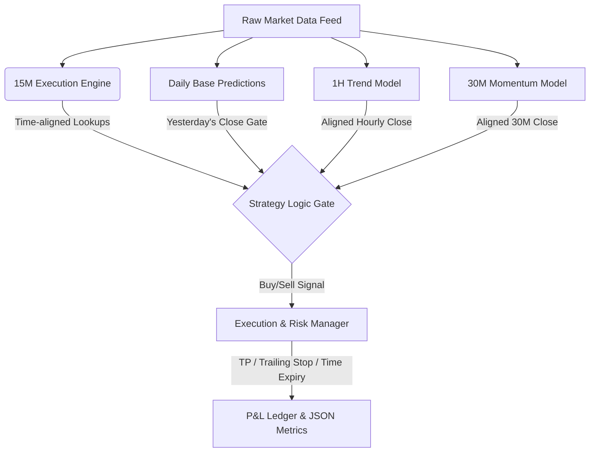

# 📈 Multi-Timeframe Intraday Trading Engine & 10 Strategies Backtester

Welcome to the comprehensive documentation of the **Multi-Timeframe Intraday Trading Engine** (`strategy_10x_backtest.py`). This framework integrates four distinct machine learning models (Daily, 1H, 30M, 15M) and simulates 10 custom trading strategies over May 2026 under strict NSE market friction conditions.

---

## 🧠 Core System Architecture

The engine functions by aligning predictions from four separate XGBoost rankers, each trained to find opportunities on different time horizons.



### 1. The Four XGBoost Timeframe Models

| Timeframe | Model Location | Feature count | Primary Purpose |
| :--- | :--- | :--- | :--- |
| **Daily** | `models/daily_xgb/` | 165 daily features | Directional Macro filter (Prevents trading against the daily tide) |
| **1-Hour** | `models/v8_upstox_3y/` | 86 features | Hourly Trend determination |
| **30-Min** | `models/v1_30min/` | 86 features | Mid-frequency volatility regime identification |
| **15-Min** | `models/v1_15min/` | 86 features | Execution-level entry timing and conviction ranking |

---

## 📊 Backtest Performance Summary (Strict 0.06% Slippage)

All statistics below represent results after subtracting a strict **0.06% round-trip transaction and slippage cost** per trade:

| ID | Strategy Name | Trades | Win Rate (WR) | Long WR | Short WR | Total Return | Profit Factor | Max Drawdown | Status |
| :---: | :--- | :---: | :---: | :---: | :---: | :---: | :---: | :---: | :---: |
| **1** | **Daily Macro Gatekeeper** | 108 | 50.9% | 50.0% | 51.7% | **+2.20%** | 1.17 | -4.04% | ✅ Profitable |
| **2** | **Short-Side Specialist** | 17 | 58.8% | N/A | 58.8% | **+0.48%** | 1.17 | -1.01% | ✅ Profitable |
| **3** | **Timeframe Divergence Fade** | 108 | 53.7% | 52.7% | 54.7% | **-0.17%** | 0.99 | -5.23% | ❌ Unprofitable |
| **4** | **Score Momentum Scalper** | 144 | 49.3% | 51.8% | 45.8% | **-2.51%** | 0.88 | -7.72% | ❌ Unprofitable |
| **5** | **Power Hour Sniper** | 72 | 41.7% | 41.7% | N/A | **-1.62%** | 0.79 | -3.56% | ❌ Unprofitable |
| **6** | **Market-Neutral Pairs** | 108 | 43.5% | 35.2% | 51.9% | **-2.00%** | 0.91 | -5.27% | ❌ Unprofitable |
| **7** | **Volatility Regime Switcher** | 146 | 45.2% | 51.1% | 36.2% | **-1.14%** | 0.96 | -7.65% | ❌ Unprofitable |
| **8** | **Opening Range Breakout (ORB)** | 14 | 64.3% | 50.0% | 75.0% | **+2.31%** | **3.92** | **-0.51%** | 🏆 **Best** |
| **9** | **Conviction Spread Z-Score** | 108 | 40.7% | 41.9% | 36.4% | **-10.61%** | 0.48 | -11.89% | ❌ Unprofitable |
| **10** | **Quad-Timeframe Unanimous** | 24 | 54.2% | **85.7%** | 41.2% | **+1.86%** | **1.60** | **-1.32%** | 🏆 **Robust** |

---

## 🛠️ In-Depth Strategy Guide

### 🏆 Strategy 8: Opening Range Breakout (ORB) + Confirmation
* **Concept:** Physical breakout of the early morning volatility bounds validated by ML model confluence.
* **Entry Setup (From 10:00 AM onwards):**
  * Morning bounds determined by 9:15 AM - 9:45 AM `High` / `Low` boundaries.
  * **LONG:** Close of 15M bar > `OR_High * 1.001` (0.1% buffer) **AND** 15M rank <= 5 **AND** 1H rank <= 10.
  * **SHORT:** Close of 15M bar < `OR_Low * 0.999` (0.1% buffer) **AND** 15M short_rank <= 5 **AND** 1H short_rank <= 10.
* **Exits:** Take Profit at **+1.00%** | Trailing Stop at **-0.40%** from peak | Time Expiry at **8 bars** (2 hours).

### 🏆 Strategy 10: Quad-Timeframe Unanimous
* **Concept:** High-conviction alignment. Requires agreement across all timeframes.
* **Entry Setup:**
  * **LONG:** 15M rank <= 3 **AND** Daily rank <= top 30% **AND** 1H rank <= 5 **AND** 30M rank <= 5.
  * **SHORT:** 15M short_rank <= 3 **AND** Daily short_rank <= top 30% **AND** 1H short_rank <= 5 **AND** 30M short_rank <= 5.
* **Exits:** Take Profit at **+1.00%** | Trailing Stop at **-0.50%** from peak | Conviction Flip (`score < 0`) | Time Expiry at **4 bars** (1 hour).

### Strategy 3: Timeframe Divergence Fade
* **Concept:** Counter-trend mean reversion. Exposes trend exhaustion by fading the hourly trend.
* **Entry Setup:**
  * **LONG:** Bearish 1H trend (bottom 30% rank) **AND** strong 15M conviction (`rank <= 5` and `conviction > p70_long`).
  * **SHORT:** Bullish 1H trend (top 30% rank) **AND** strong 15M short conviction (`rank <= 5` and `conviction > p70_short`).
* **Exits:** Conviction Flip (`score < 0`) | Time Expiry at **2 bars** (30 mins).

### Strategy 4: Score Momentum Scalper
* **Concept:** Momentum acceleration. Capitalizes on fast momentum shifts.
* **Entry Setup (9:45 AM - 2:45 PM):**
  * **LONG:** 15M rank <= 5 **AND** Rising conviction scores: `conv[t] > conv[t-1] > conv[t-2]`.
  * **SHORT:** 15M short_rank <= 5 **AND** Rising short scores: `conv[t] > conv[t-1] > conv[t-2]`.
* **Exits:** Momentum slowdown (`conv[t] < conv[t-1]`) | Time Expiry at **4 bars** (1 hour).

---

## ⚠️ Critical Slippage & Cost Drag Analysis

> [!WARNING]
> **Friction Destroys Scalpers:** Increasing the round-trip friction cost from **0.03%** to **0.06%** had a catastrophic impact on high-frequency strategies. 
> 
> * **Strategy 4 (Score Momentum Scalper)** went from **+1.81% (at 0.03%)** to **-2.51% (at 0.06%)**. Since it generates 144 trades, the extra slippage cost created a massive **4.32% drag** on P&L.
> * **Strategy 6 (Market-Neutral Pairs)** dropped from **+1.24%** to **-2.00%**.
> * **Strategy 8 (ORB)** and **Strategy 10 (Quad-TF)** remained highly profitable because of their lower trade frequency (14 and 24 trades) and higher average hold durations, allowing them to ride trends through the friction.

---

## 🚀 Execution & Backtest Guide

### Prerequisites
Make sure your environment is activated and requirements are installed:
```powershell
python -m pip install -r requirements.txt
```

### Running the Backtest
Run the main script to trigger the full ML scoring, pre-computations, and simulation loops:
```bash
python scripts/strategy_10x_backtest.py
```

### Key Output Files
* **[strategy_10x_results.json](file:///c:/Users/loq/Desktop/Trading/finalgo/data/strategy_10x_results.json)**: Raw JSON metrics for each strategy (wins, losses, win rates, DD, profit factors, hold time).
* **[backtest_results_summary.md](file:///C:/Users/loq/.gemini/antigravity/brain/c427ccb6-3bdf-42a4-9ef1-49e41ba8a01e/backtest_results_summary.md)**: Human-readable markdown report of the backtest.
