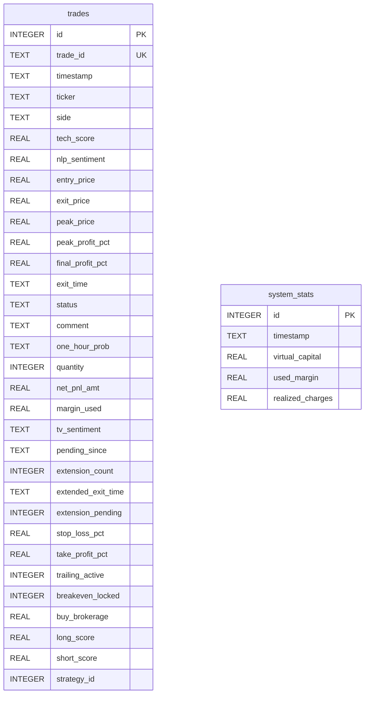

# 💾 Database Architecture (SQLite Schema & Analytics)

To maintain absolute financial transparency and auditability, the Vanguard Engine logs every event, trade modification, AI audit, and capital adjustment into a local SQLite database located at `data/vanguard_trades.db`. 

The database management is centralized in `scripts/database_manager.py`, which handles schema initialization, dynamic migrations, trade logging, and granular performance statistics.

---

## 📊 Database Entity Relationship



---

## 🏛️ Core Table Schemas

### 1. The `trades` Table
Stores granular parameters for every generated signal, active trade, and vetoed attempt.

| Column | Type | Description |
| :--- | :---: | :--- |
| `id` | INTEGER | Primary Key (Autoincrement). |
| `trade_id` | TEXT | Unique identifier (e.g., `T-20260531-01`). |
| `timestamp` | TEXT | ISO Timestamp of signal generation (IST). |
| `ticker` | TEXT | Stock symbol (e.g., `RELIANCE`, `TCS`). |
| `side` | TEXT | `LONG` or `SHORT`. |
| `tech_score` | REAL | The ML ranking conviction score. |
| `nlp_sentiment`| REAL | Sentiment score from PrimoGPT. |
| `entry_price` | REAL | Execution entry price. |
| `exit_price` | REAL | Execution exit price. |
| `peak_price` | REAL | Maximum price reached during trade lifecycle (for trailing stop math). |
| `peak_profit_pct`| REAL| Maximum profit percentage achieved. |
| `final_profit_pct`| REAL| Final net return percentage. |
| `exit_time` | TEXT | ISO Timestamp of trade closure (IST). |
| `status` | TEXT | Current state: `OPEN`, `CLOSED`, `STOP_LOSS`, `TAKE_PROFIT`, `VETOED`, `VETOED_EXPIRED`. |
| `comment` | TEXT | Execution notes (e.g., veto reasons or strategy identifiers). |
| `one_hour_prob` | TEXT | Predicted probability score for 1-hour return. |
| `quantity` | INTEGER | Executed share count based on margin allocation. |
| `net_pnl_amt` | REAL | Net profit or loss in INR (minus all slippage/charges). |
| `margin_used` | REAL | Margin consumed by the trade in INR. |
| `tv_sentiment` | TEXT | TradingView technical sentiment indicators flag. |
| `pending_since` | TEXT | Pending state entry timestamp. |
| `extension_count`| INTEGER| Number of time extensions granted by AI Audit. |
| `extended_exit_time`| TEXT| Extended hard-close timestamp. |
| `extension_pending`| INTEGER| Boolean flag if extension audit is pending. |
| `stop_loss_pct` | REAL | Dynamic Stop Loss percentage calculated via 15M ATR (clamped [0.30%, 1.50%]). |
| `take_profit_pct`| REAL | Dynamic Take Profit percentage calculated via 15M ATR (clamped [0.75%, 2.50%]). |
| `trailing_active`| INTEGER| Boolean flag if trailing stop-loss is engaged. |
| `breakeven_locked`| INTEGER| Boolean flag if breakeven locking is active. |
| `buy_brokerage` | REAL | Calculated brokerage charges upon entry. |
| `long_score` | REAL | Raw long-side prediction score from model. |
| `short_score` | REAL | Raw short-side prediction score from model. |
| `strategy_id` | INTEGER | ID of the triggering strategy (e.g., `8` or `10`). |

### 2. The `system_stats` Table
Tracks capital recycling, margin consumption, and transaction fees across sessions.

*   `id` (INTEGER PK): Record identifier.
*   `timestamp` (TEXT): Date and time of capture.
*   `virtual_capital` (REAL): Total value of redundant + active capital pool.
*   `used_margin` (REAL): Current margin allocated to open trades.
*   `realized_charges` (REAL): Cumulative transaction fees paid.

---

## 🚀 SQLite Migration System

To prevent database errors when deploying upgrades, `init_db()` runs automatic structural migrations. If a column is missing from the existing database file, the manager safely alters the table structure:

```python
for col, col_type in [
    ('one_hour_prob', 'TEXT'),
    ('quantity', 'INTEGER'),
    ('net_pnl_amt', 'REAL'),
    ('margin_used', 'REAL'),
    ('buy_brokerage', 'REAL'),
    ('exit_price', 'REAL'),
    ('pending_since', 'TEXT'),
    ('extension_count', 'INTEGER'),
    ('extended_exit_time', 'TEXT'),
    ('extension_pending', 'INTEGER'),
    ('stop_loss_pct', 'REAL'),
    ('take_profit_pct', 'REAL'),
    ('trailing_active', 'INTEGER'),
    ('breakeven_locked', 'INTEGER'),
    ('long_score', 'REAL'),
    ('short_score', 'REAL'),
    ('strategy_id', 'INTEGER'),
]:
    try:
        cursor.execute(f'ALTER TABLE trades ADD COLUMN {col} {col_type}')
        conn.commit()
    except sqlite3.OperationalError:
        pass # Column already exists, skip!
```

---

## 📈 Performance Aggregation Queries

The `database_manager.py` exposes several analytical functions used by the Vanguard Dashboard (`vanguard_dashboard.py`):
*   `get_performance_stats()`: Aggregates daily, weekly, and all-time profit (alpha) and trade count. It also tracks the performance of trades saved by the **AI Veto** system to audit LLM effectiveness.
*   `get_portfolio_summary()`: Compiles a financial summary for the current day: total wins, losses, gross and net P&L in INR, average trade size, and total exchange charges.
*   `get_strategy_performance()`: Breaks down trading metrics grouped by `strategy_id`, calculating win rates, total alpha, and profit factors for each strategy.

---

## 👁️ Key Related Notes
*   See how the live scanner logs trades and calculates quantity: [[01 — Architecture/Execution & Runtime/Shadow Tracker & Execution Loop|Shadow Tracker & Execution Loop]].
*   See how the AI Veto audits trades and edits database rows: [[01 — Architecture/Execution & Runtime/AI Veto & Gemini Audit|AI Veto & Gemini Audit]].
*   Check the dashboard code in scripts: [[01 — Architecture/Data & Code/Codebase File Directory|Codebase File Directory]].
