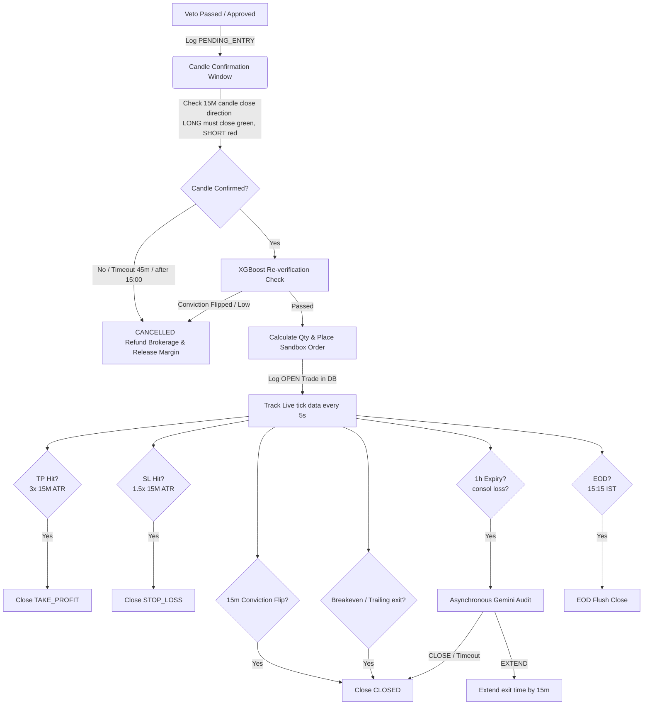

# 🔄 Shadow Tracker & Execution Loop

The risk management, entry confirmation, and live trade tracking of the Vanguard engine are centrally governed by the **Shadow Tracker**. Implemented in `scripts/vanguard/trade_state.py` (lifecycle rules) and `scripts/vanguard/orchestrator.py` (loop coordination), this daemon thread polls the WebSocket price feed every 5 seconds to manage live sandbox portfolios, execute trailing risk strategies, and process dynamic exit rules.

---

## 🚦 Core Execution Lifecycle

Every signal generated by the scanners passes through a strict execution pipeline designed to eliminate charge leakage and trade execution slippage.

---

## 🛠️ Dynamic Risk Brackets (Volatility-Adjusted)

Vanguard V2.3 has completely retired static exit parameters. At trade entry, the engine programmatically calculates dynamic brackets based on the **15-minute resampled Average True Range (ATR)** using 2 days of historical candles:

### 1. Dynamic Take Profit (ATR-TP)
*   **Multiplier**: **3.0x** the calculated 15M ATR percentage.
*   **Boundary Clamping**: Restricts the target between a minimum of **+0.75%** and a maximum of **+2.50%**.
*   **Default Value**: Reverts to **+1.00%** if indicators are missing.

### 2. Dynamic Stop Loss (ATR-SL)
*   **Multiplier**: **1.5x** the calculated 15M ATR percentage.
*   **Boundary Clamping**: Restricts the protective boundary between a minimum of **0.30%** and a maximum of **1.50%**.
*   **Default Value**: Reverts to **-0.50%** if indicators are missing.

---

## 🚦 Live Entry & Exit Rules

### 1. 15-Minute Candle Direction Close
*   When a signal is approved, it enters the database as `PENDING_ENTRY`. 
*   The trade **cannot** be executed immediately. The system waits for the current 15-minute candle to close.
*   The entry is confirmed **only** if the candle closes in our direction:
    *   **LONG**: Close price must be strictly greater than Open price (Green candle).
    *   **SHORT**: Close price must be strictly less than Open price (Red candle).
*   **Cancellation Gate**: If confirmation fails within **45 minutes**, or if the session crosses the **3:00 PM (15:00 IST) time cutoff**, the trade is marked `CANCELLED`.
*   **Bug-Fix (Charge Leakage)**: Upon cancellation, the system immediately **refunds** the buy brokerage (₹10) pre-charged at signal creation and releases the reserved trade margin from system stats.

### 2. XGBoost Entry Re-verification
*   Right before placing the broker order upon candle close, the engine re-scores the ticker via `_get_current_conviction()`.
*   If the model's conviction has dropped below `0.10` (or faded by $>0.05$ for manual signals) or has flipped in direction, confirmation is blocked and the trade is `CANCELLED` (brokerage and margin refunded).

### 3. 15-Minute Conviction Flip Check
*   Every 15 minutes during an active trade, the loop re-checks model alignment (utilizing cached full universe scores to avoid std-NaN errors).
*   If the model's conviction has flipped against the trade direction, the trade is **exited immediately** at market value (status logged as `CLOSED` with `XGBoost conviction flipped`), cutting losses before the stop loss is even touched.

### 4. Breakeven & Trailing Stop-Loss Management
*   **Breakeven Locking**: Once the trade reaches a profit percentage equal to its dynamic `stop_loss_pct` (e.g. $+0.45\%$), breakeven is locked. If price reverses, the trade is closed immediately at **0.00% P&L**, ensuring capital preservation.
*   **Trailing Stop**: Once profit reaches double the dynamic stop loss (`stop_loss_pct * 2.0`), trailing stop is engaged. The trailing stop is pegged at `peak_profit_pct - stop_loss_pct`. If P&L falls below this trailing level, the position is flushed.

### 5. Time Stop & AI Extension
*   Trades have a hard-close limit of **1 hour** (calculated at entry).
*   If the 1 hour expires and the trade is at a loss, the engine fires an asynchronous background thread to query Gemini.
*   If Gemini returns `EXTEND`, the exit time is extended by **15 minutes** (up to 2 times, 30 mins max). Otherwise, the trade is closed.

### 6. EOD Flush
*   At **15:15 IST**, signal sweeps are halted, and the loop programmatically flushes all remaining open trades (`OPEN`, `PENDING_ENTRY`, `VETOED`) at market value, ensuring we never carry risk overnight.

---

## 💰 Allocation & Cooldowns

*   **Available Pool Sizing**: Redundant liquid pool available capital is calculated daily. Available margin is allocated at **10% per slot** across a maximum of **5 concurrent trade slots**.
*   **30-Minute Cooldowns**: 
    *   **Entry Cooldown**: Tickers closed or expired are blocked from new entry sweeps for **30 minutes** (`self._mark_recently_closed()`).
    *   **Veto Cooldown**: Tickers vetoed by the AI layer are blocked from scanners for **30 minutes** (`self._mark_recently_vetoed()`).

---

## 👁️ Key Related Notes
*   Review Stage 1 and Stage 2 AI Veto prompts: [[01 — Architecture/Execution & Runtime/AI Veto & Gemini Audit|AI Veto & Gemini Audit]].
*   See the SQLite columns supporting dynamic exit rules: [[01 — Architecture/Data & Code/Database Architecture|Database Architecture]].
*   See how available pool balances are restored at startup: [[02 — Models/_Shared/Model Registry & File Structures|Model Registry & File Structures]].
