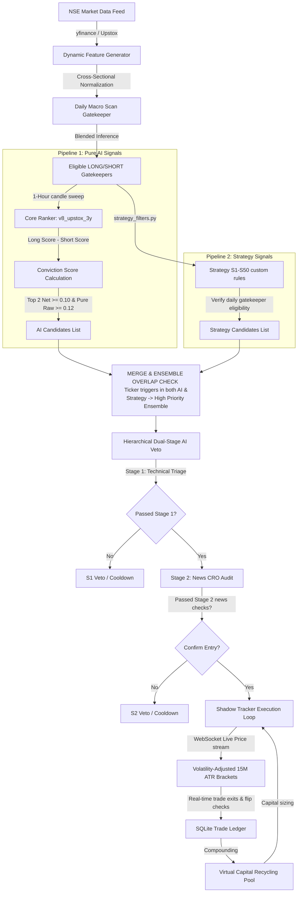

# 🏛️ Global System Architecture

The **Vanguard V2.3 High-Precision Trading Engine** is an industrial-hardened, low-friction intraday scanning and execution system optimized for the NSE (India) market. The system integrates advanced machine learning technical ranking models with a hierarchical dual-stage LLM-based sentiment and technical audit layer to achieve robust, high-win-rate intraday trading performance.

---

## 🏗️ Core Architectural Blueprint

The engine operates on a structured timeline, synchronizing start-of-day daily filters with real-time intraday scans and execution risk tracking. The architecture explicitly separates raw AI signal generation from structural strategy filters before ensembling them.

---

## 🧠 Core Architectural Layers

### 1. Daily Macro Scanning Layer (Gatekeeper)
Before any intraday signals are generated, the engine executes a comprehensive **Daily Macro Scan** at startup/day-start (orchestrated via `scripts/vanguard/orchestrator.py`):
*   **Historical Context**: Automatically downloads 1 year of daily historical bars for all symbols via `yfinance`.
*   **Daily Scan Inference**: Calculates technical indicators and runs cross-sectional normalization before passing them to the gatekeeper models:
    *   **Daily Macro XGBoost** (`models/daily_xgb/`): Evaluates long-term price action and trend strength using Long and Short boosters.
*   **The Eligible Gate**: Selects the top 40% of ranked tickers as `long_eligible_tickers` and `short_eligible_tickers`. Any intraday signal generated for a stock that conflicts with its daily gatekeeper classification is discarded instantly.

### 2. Core Intraday Scanning & ML Ranking Layer
*   **Drift-Free Scheduling**: The main engine sweep runs exactly on 15-minute candle boundaries (`:00`, `:15`, `:30`, `:45`) using a precise remainder wait-scheduler to prevent clock drift.
*   **Technical Feature Pipeline**: Downloads 90 days of hourly candlestick data from Upstox (or `yfinance` fallback) and computes **86 core features** via `scripts/feature_utils.py`.
*   **Active Core Ranker**: Feeds the normalized features into the registered active model—currently **v8_upstox_3y** via `scripts/vanguard/model_inference.py`.
*   **Conviction Score Engine**: Instead of predicting raw returns directly, the system runs separate Long and Short models. It calculates a net conviction score (e.g., `Long_Conviction = long_score - short_score`) and ranks the tickers cross-sectionally in descending order (highest conviction first), preventing retail FOMO and distribution traps.

### 3. Hierarchical Dual-Stage AI Veto Layer
Numeric indicators cannot capture fundamental shocks. To prevent technical traps, the engine passes all pre-filtered signals to a **Hierarchical Dual-Stage AI Audit** (orchestrated in `scripts/vanguard/ai_veto.py`):
*   **Stage 1: Technical Triage**: Queries Gemini models via `scripts/gemini_client_manager.py` for rapid structural validation (RSI, Stochastic, Bollinger Bands, Nifty/VIX regime). Sentiment conflicts trigger an immediate technical veto.
*   **Stage 2: CRO News Grounding Audit**: Queries Gemini with Google Search grounding enabled. Acting as a Chief Risk Officer (CRO), it scans recent earnings, rating changes, and block deals, filtering them through a **6-rule Veto Decision Matrix**.

### 4. Shadow Execution & Portfolio Management Layer
Approved trades are passed to the **Shadow Tracker Execution Loop** managed by `scripts/vanguard/trade_state.py` and `scripts/vanguard/broker_adapter.py`:
*   **Entry Confirmation**: Waits for the current 15M candle to close in the trade's direction and runs an XGBoost re-verification sweep before routing orders.
*   **Volatility-Adjusted Risk Brackets**: Programmatically calculates brackets at entry via 15M resampled ATR:
    *   **Take Profit (TP)**: 3x ATR, clamped between `+0.75%` and `+2.50%` (default `1.00%`).
    *   **Stop Loss (SL)**: 1.5x ATR, clamped between `0.30%` and `1.50%` (default `0.50%`).
*   **Active Risk Controls**: Tracks trades every 5 seconds utilizing WebSocket streaming. Employs advanced protection rules: **15-Min Conviction Flip**, **Breakeven Locking**, and **Trailing Stop-Losses**.
*   **Time Stop Extensions**: Automatically queries Gemini in the background to grant up to two 15-minute extensions if the position is coiling for a breakout right near expiry.

---

## ⚡ Execution Batch Files

The Vanguard system is controlled via three admin Windows batch files:
*   `run_vanguard_system.bat`: Boots the active live trading engine and scans tickers.
*   `run_upstox_debug.bat`: Logs into Upstox, fetches tokens, and validates connectivity.
*   `run_error_monitor.bat`: Establishes real-time logging monitoring for critical error feeds.

---

## 👁️ Key Related Notes
*   Review our detailed training metrics, walk-forward folds, and hyperparameter registers: [[02 — Models/_Shared/Model Performance & Statistics|Model Performance & Statistics]].
*   See the complete configuration list of model versions: [[02 — Models/_Shared/Model Registry & File Structures|Model Registry & File Structures]].
*   Review how the dual-stage AI veto manages risk: [[01 — Architecture/Execution & Runtime/AI Veto & Gemini Audit|AI Veto & Gemini Audit]].
*   See how shadow trades and trailing stops are executed: [[01 — Architecture/Execution & Runtime/Shadow Tracker & Execution Loop|Shadow Tracker & Execution Loop]].
