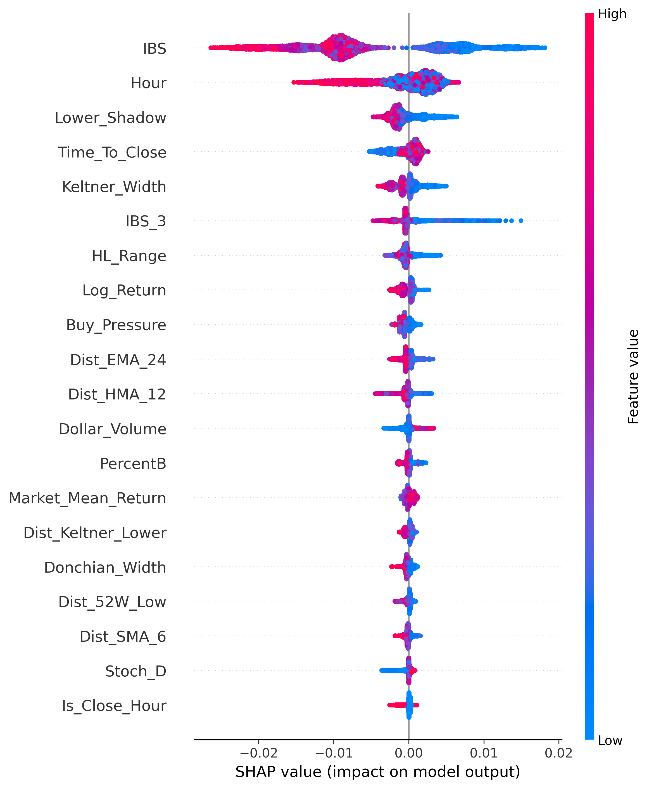
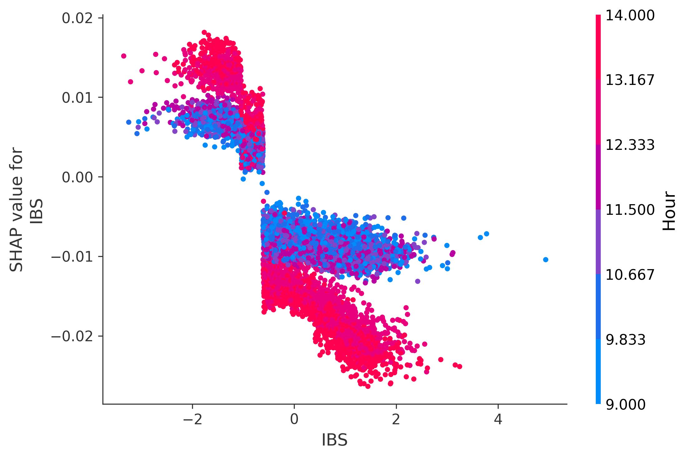
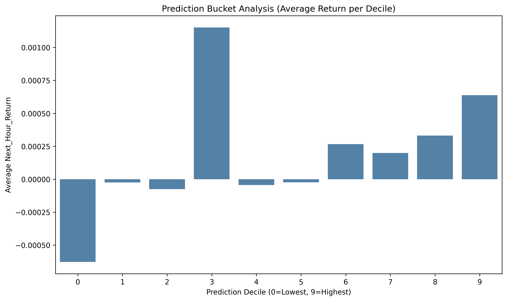
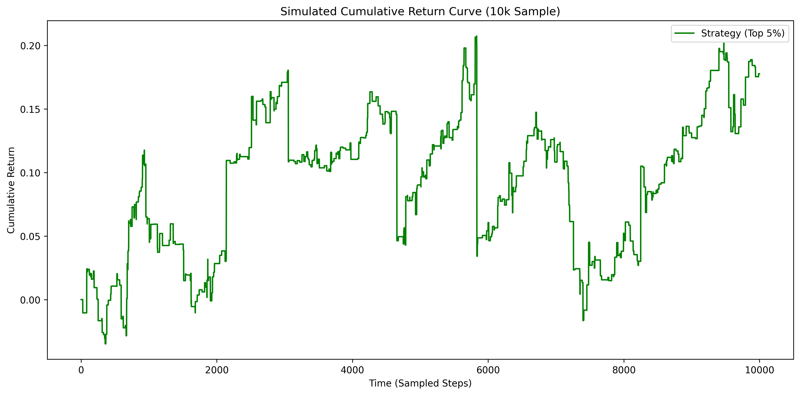

# Advanced Alpha Visualizations (1-Hour Core Model)

This document contains advanced Machine Learning visualizations used for alpha discovery and model evaluation of the **1-Hour Vanguard Core Ranking Model (`v8_upstox_3y`)**. 

The visualizations were generated using a 10,000-row random sample from `ranking_data_upstox_3y.csv`.

## 1. SHAP Summary Plot
The SHAP Summary Plot provides a global view of feature importance and the *direction* of their impact.
It reveals whether high or low values of a specific technical indicator push the model's conviction towards a Long or Short signal.

## 2. SHAP Dependence Plot
The SHAP Dependence Plot isolates the single most important feature to uncover non-linear alpha interactions and thresholds.

## 3. Prediction Bucket Analysis
This bar chart groups the model's predictions into deciles (0-10% lowest confidence, to 90-100% highest confidence) and plots the average actual `Next_Hour_Return` for each bucket.
A strong monotonic slope upward indicates that higher model conviction successfully corresponds to higher returns.

## 4. Simulated Cumulative Return Curve
This curve simulates a naive Long-only strategy by buying the Top 5% of predictions every hour over the sampled dataset, verifying if the alpha generated is sustainable over time.

---
*Generated via Jupyter MCP Pipeline*
