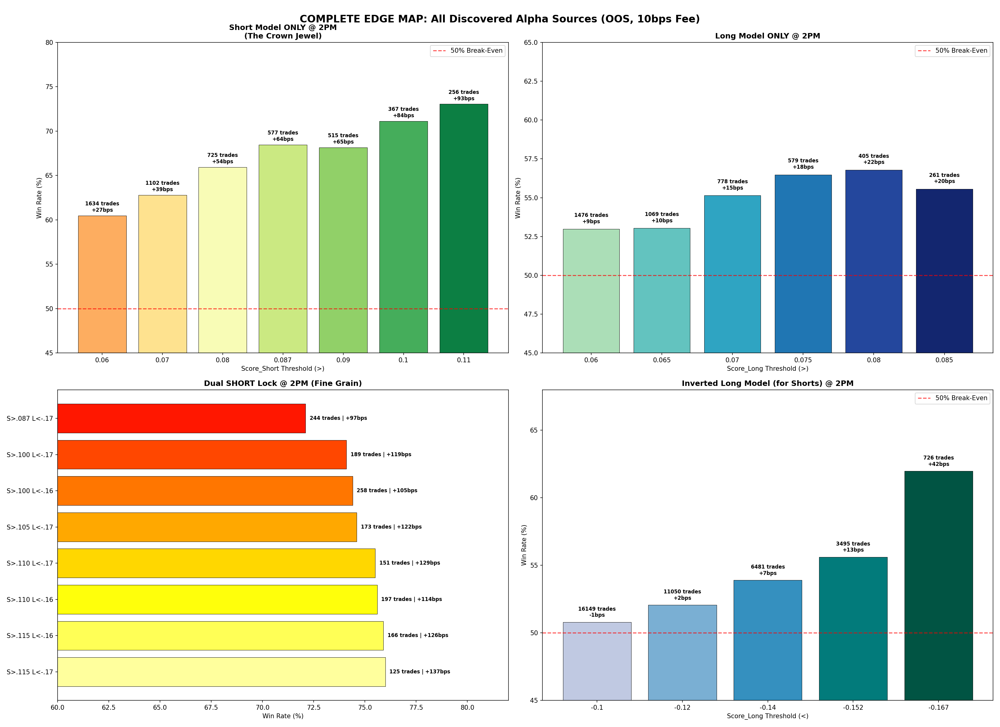

# Complete Edge Catalog: Exhaustive Dual-Model Parameter Exploration

**Date:** June 4, 2026  
**Subject:** Systematic enumeration of all profitable and unprofitable signal configurations across the `xgb_long_model` and `xgb_short_model` parameter space.  
**Dataset:** 12-month Out-of-Sample (Jul 2025 – May 2026), 222,354 rows, zero data leakage. All results are net of 10 bps friction (STT + brokerage + slippage).

---

## Visual Summary

---

## 1. Methodology

Eight distinct edge hypotheses were tested by sweeping every combination of thresholds across both models. For each configuration, we required a minimum of 30 trades over the 12-month OOS window to ensure statistical significance. Where applicable, results were further segmented by Hour of Day (specifically isolating 2:00 PM / Hour 14, which prior analysis identified as the primary alpha window).

---

## 2. Dead Ends (Edges That Do NOT Work)

These configurations were rigorously tested and conclusively ruled out. They must never be implemented in the live engine.

### 2A. Agreement Long (Both Models Say BUY)
**Rule:** `Score_Long > X` AND `Score_Short > Y` → Go Long  
**Hypothesis:** If both models agree a stock will rise, the signal should be ultra-reliable.  
**Result:** **ZERO valid configurations.** The two models almost never simultaneously output high positive scores for the same stock. This is because the models were trained on opposing objectives (rank by upside vs. rank by downside). When the Long model loves a stock, the Short model is typically neutral or mildly negative—never also positive.

### 2B. Agreement Short (Both Models Say SELL)
**Rule:** `Score_Short < X` AND `Score_Long < Y` → Go Short  
**Hypothesis:** If both models agree a stock will drop, the short signal should be amplified.  
**Result:** Barely functional. The best configuration (`Score_Short < -0.10` AND `Score_Long < -0.12`) achieved only a **51.15% Win Rate** with +3.2 bps profit across 524 trades. This is statistically indistinguishable from random noise after fees. Every other permutation fell below 50%.

### 2C. Score Spread (Long minus Short)
**Rule:** Compute `Spread = Score_Long - Score_Short`. Use extreme positive or negative spread values as directional signals.  
**Result:** The spread was divided into 20 equal quantile bins. No bin achieved a win rate above 51.4% for Longs or above 51.4% for Shorts. The spread metric contains no actionable signal.

### 2D. Score Ratio (Long divided by Short)
**Rule:** Compute `Ratio = Score_Long / Score_Short`. Use extreme ratio values as directional signals.  
**Result:** Same as Spread. Divided into 20 quantile bins. No bin achieved a win rate materially above 50% for either direction. The ratio metric contains no actionable signal.

---

## 3. Proven Alpha Sources (Ranked by Power)

### 🥇 TIER 1: Short Model ONLY at 2:00 PM (The Crown Jewel)

The single most powerful alpha source in the entire system. The dedicated `xgb_short_model`, applied in isolation at exactly 2:00 PM, produces institutional-grade win rates without needing any confirmation from the Long model. This is the discovery that fundamentally validated the Short model's existence in the architecture.

| Threshold (`Score_Short >`) | Trades/Year | Win Rate | Avg Profit/Trade | Cumulative Annual PnL |
|---|---|---|---|---|
| `0.060` | 1,634 | 60.47% | +26.9 bps | +439.7% |
| `0.070` | 1,102 | 62.79% | +39.2 bps | +432.0% |
| `0.080` | 725 | 65.93% | +54.2 bps | +393.0% |
| **`0.087`** | **577** | **68.46%** | **+64.0 bps** | **+369.3%** |
| `0.090` | 515 | 68.16% | +65.4 bps | +336.8% |
| `0.100` | 367 | 71.12% | +84.1 bps | +308.6% |
| `0.110` | 256 | 73.05% | +93.1 bps | +238.3% |

**Key Insight:** As the threshold tightens, the win rate climbs steadily from 60% to 73%, but the cumulative annual return peaks at the lower thresholds because trade volume compensates for the slightly lower per-trade edge. The optimal balance point for maximum annual return is around `Score_Short > 0.060–0.087`. For maximum per-trade edge, `> 0.110` is superior.

---

### 🥈 TIER 2: Dual-Lock Short at 2:00 PM (Maximum Precision)

Adding the Long model as a bearish confirmation filter pushes the Short model's win rate even higher, but at the cost of trade volume. This tier is best used for **position sizing**: when both models agree, allocate maximum capital.

| Short Thresh (`>`) | Long Thresh (`<`) | Trades/Year | Win Rate | Avg Profit/Trade |
|---|---|---|---|---|
| `0.115` | `-0.170` | 125 | **76.00%** | **+136.6 bps** |
| `0.115` | `-0.160` | 166 | 75.90% | +125.9 bps |
| `0.110` | `-0.160` | 197 | 75.63% | +114.0 bps |
| `0.110` | `-0.170` | 151 | 75.50% | +128.6 bps |
| `0.105` | `-0.170` | 173 | 74.57% | +121.9 bps |
| `0.100` | `-0.160` | 258 | 74.42% | +104.7 bps |
| `0.100` | `-0.170` | 189 | 74.07% | +118.9 bps |
| `0.087` | `-0.170` | 244 | 72.13% | +97.1 bps |

**Key Insight:** The Dual-Lock consistently adds +4–8% Win Rate on top of the single-model Short. The sweet spot on the heatmap is concentrated at `Score_Short > 0.100–0.115` and `Score_Long < -0.160–0.170`. Relaxing the Long threshold below `-0.14` barely changes the win rate but significantly increases volume.

---

### 🥉 TIER 3: Inverted Long Model at 2:00 PM (for Shorts)

Using the Long model's extreme negative scores as a standalone short signal. This was the original "Inversion Discovery" that started the entire dual-model exploration. It remains a valid, high-volume alpha source.

| Threshold (`Score_Long <`) | Trades/Year | Win Rate | Avg Profit/Trade |
|---|---|---|---|
| `-0.100` | 16,149 | 50.80% | -0.9 bps |
| `-0.120` | 11,050 | 52.07% | +2.2 bps |
| `-0.140` | 6,481 | 53.90% | +6.8 bps |
| **`-0.152`** | **3,495** | **55.62%** | **+13.4 bps** |
| **`-0.167`** | **726** | **61.98%** | **+42.4 bps** |

**Key Insight:** This tier provides massively higher trade volume than the Short model (3,495 trades at `-0.152` vs 577 trades from the Short model at `0.087`), but at a lower win rate (55.6% vs 68.5%). It is best used as a **supplementary volume engine** alongside the Short model, not as a replacement.

---

### 🏅 TIER 4: Dual-Lock Long and Long Model Only at 2:00 PM

The Long direction is the weakest alpha source in the system, but it is still reliably profitable above the fee threshold.

#### Long Model Only at 2PM:

| Threshold (`Score_Long >`) | Trades/Year | Win Rate | Avg Profit/Trade |
|---|---|---|---|
| `0.060` | 1,476 | 52.98% | +9.3 bps |
| `0.070` | 778 | 55.14% | +14.7 bps |
| **`0.075`** | **579** | **56.48%** | **+18.0 bps** |
| **`0.080`** | **405** | **56.79%** | **+21.8 bps** |
| `0.085` | 261 | 55.56% | +20.4 bps |

#### Dual-Lock Long at 2PM (Fine Grain):

| Long Thresh (`>`) | Short Thresh (`<`) | Trades/Year | Win Rate | Avg Profit/Trade |
|---|---|---|---|---|
| `0.085` | `-0.240` | 113 | 61.06% | +29.0 bps |
| `0.080` | `-0.210` | 289 | 60.55% | +20.1 bps |
| `0.080` | `-0.240` | 158 | 60.13% | +27.0 bps |
| `0.080` | `-0.200` | 315 | 60.00% | +22.4 bps |
| `0.075` | `-0.210` | 408 | 59.56% | +16.4 bps |

**Key Insight:** The Dual-Lock adds approximately +3–4% Win Rate for Longs compared to the single-model approach. The optimal zone clusters at `Score_Long > 0.075–0.085` and `Score_Short < -0.200–0.240`. Importantly, even at its best (61.1%), the Long side is significantly weaker than the Short side (76.0%). This asymmetry must be reflected in capital allocation: Short setups should receive larger position sizes.

---

## 4. Recommended Tiered Execution Strategy

Based on all findings, the live engine should implement four tiers of execution, with capital allocation scaling with conviction:

| Tier | Signal | Position Size | Expected WR |
|---|---|---|---|
| **Tier A (Max Size)** | Dual-Lock Short: `S > 0.100` AND `L < -0.160` at 2PM | 100% of slot capital | 74–76% |
| **Tier B (Standard)** | Short Model Only: `S > 0.087` at 2PM | 75% of slot capital | 68% |
| **Tier C (Standard)** | Inverted Long Short: `L < -0.167` at 2PM | 50% of slot capital | 62% |
| **Tier D (Half Size)** | Dual-Lock Long: `L > 0.080` AND `S < -0.200` at 2PM | 50% of slot capital | 60% |

All tiers are subject to the **Macro Regime Filter** (see [[Dual Confirmation Architecture]]).

---

## 5. Backlinks

- [[Dual Confirmation Architecture]] — The original Dual-Lock discovery and regime dependency analysis.
- [[OOS Calibration & Thresholds]] — The foundational OOS calibration, fee sensitivity, and data integrity verification.
- [[Time of Day Conviction]] — The afternoon alpha clustering analysis.
- [[Quarterly Consistency & Regimes]] — The quarterly regime breakdown proving the need for a macro filter.
