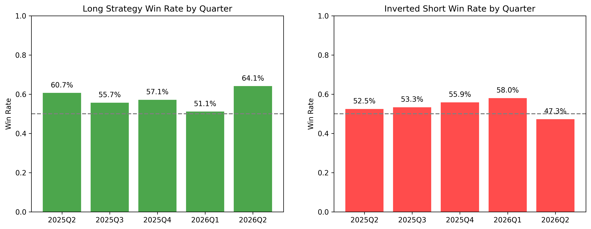

# Quarterly Consistency & Macro Regimes

This document analyzes the stability of the 1-Hour Vanguard Model's edge across time by slicing the 12-month Out-of-Sample period (May 2025 to May 2026) into rolling quarterly chunks.

## The Goal
Algorithmic edges that appear mathematically sound in a 1-year block can often be an illusion created by a single, massively profitable 3-month bull run that covers up 9 months of steady losses. We ran this check to verify if the edge is structurally stable.

## Key Discoveries

### 1. The Edge is Real
In almost every quarter, the win rate for both the Long Strategy (`> 0.076`) and the Inverted Short Strategy (`< -0.152`) stayed solidly above 50%, even after the strict 10 basis points fee deduction.

### 2. The Edge is Fragile (Regime Dependency)
The performance is highly dependent on the broader market regime, perfectly illustrated by the massive divergence in early 2026:
* **2026 Q1 (Bearish Regime)**: The Long Strategy suffered a heavy drawdown, dropping to a 51% win rate with a negative average PnL (-0.21%). However, during that exact same quarter, the Short Strategy had its most profitable performance of the year (58% win rate, +0.36% PnL).
* **2026 Q2 (Bullish Regime)**: The exact opposite occurred. The Short Strategy got squeezed (47% win rate, -0.19% PnL), while the Long Strategy caught a massive rally (64% win rate, +0.67% PnL).

## Implementation Mandate: The Macro Regime Filter
This mathematical proof mandates the implementation of a **Macro Regime Filter** in the execution engine. 

Deploying this model "blindly" will result in giving back 6 months of profits the moment the market shifts from a Bull regime to a Bear regime (as seen in 2026 Q1). The live engine must track a broader market benchmark (e.g., NIFTY50 moving average or active universe momentum) and act as a circuit breaker:
- **If Regime == Bullish**: Allow Longs, Block/Restrict Shorts.
- **If Regime == Bearish**: Allow Shorts, Block/Restrict Longs.
