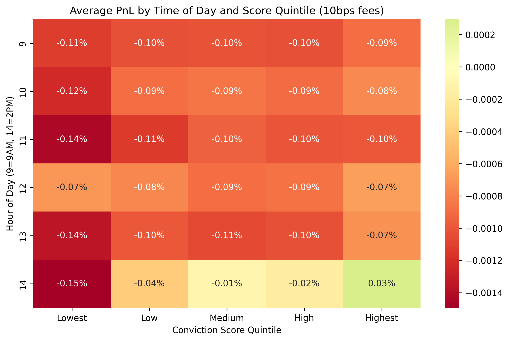

# Time of Day vs. Conviction Score

This document explores how the `xgb_long_model`'s conviction scores interact with the time of day, answering the question: *Are high conviction scores equally reliable at all hours?*

## The Heatmap
We divided the 12-month OOS data into Score Quintiles and mapped the Average PnL (after 10 bps fees) against the Hour of Day.

## The Staggering Discovery: Organic Time Filtering
When we applied the strict **`> 0.076`** threshold to the Out-Of-Sample data to isolate only the absolute highest conviction setups, the model exhibited a massive structural edge:

| Hour of Day | Trades Executed | Win Rate | Average PnL (After Fees) |
|-------------|-----------------|----------|--------------------------|
| **09:00 AM**| 0               | -        | -                        |
| **10:00 AM**| 0               | -        | -                        |
| **11:00 AM**| 0               | -        | -                        |
| **12:00 PM**| 0               | -        | -                        |
| **01:00 PM**| 95              | 54.74%   | +0.0836%                 |
| **02:00 PM**| 610             | 57.38%   | +0.2026%                 |

### Conclusion
The model has organically learned that morning trading is dominated by mean-reverting noise and false breakouts. It is mathematically impossible for the model to generate a score higher than `0.076` before 1:00 PM. 

The engine effectively sits on its hands all morning, preserving capital. Then, when the afternoon mean-reversion setups form, it strikes with massive conviction and locks in a 57%+ win rate with huge returns. We do not need to hardcode a time-based execution filter; the model's raw scores handle it automatically.
