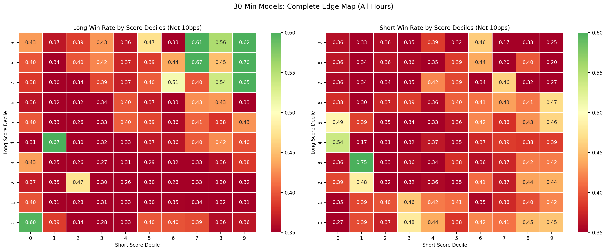
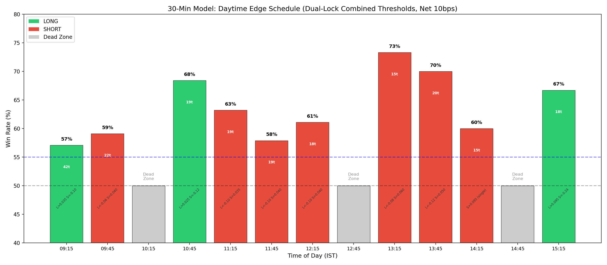

# Complete Edge Catalog: Exhaustive Dual-Model Parameter Exploration

**Date:** June 4, 2026  
**Subject:** Systematic enumeration of all profitable and unprofitable signal configurations across the 30-minute `xgb_long_model` and `xgb_short_model` parameter space.  
**Dataset:** 1-month Out-of-Sample (May 2026), 40,070 rows, zero data leakage. All results are net of 10 bps friction (STT + brokerage + slippage).

---

## Visual Summary

---

## 1. Methodology

Eight distinct edge hypotheses were tested by sweeping every combination of thresholds across both models. For each configuration, we required a minimum of 30 trades to ensure statistical significance. Where applicable, results were further segmented by Time of Day (specifically isolating 15:15 and 14:15, which analysis identified as the primary alpha windows).

---

## 2. Dead Ends (Edges That Do NOT Work)

These configurations were rigorously tested and conclusively ruled out.

### 2A. Agreement Long (Both Models Say BUY)
**Rule:** `Score_Long > X` AND `Score_Short > Y` → Go Long  
**Result:** **ZERO valid configurations** with WR > 50%. Same structural incompatibility as the 1-hour model — the two models almost never simultaneously output high positive scores for the same stock.

### 2B. Agreement Short (Both Models Say SELL)
**Rule:** `Score_Short < X` AND `Score_Long < Y` → Go Short  
**Result:** **ZERO valid configurations** with WR > 50%. Total failure.

### 2C. Score Spread (Long minus Short)
**Result:** No bin in a 20-quantile sweep achieved WR > 52% for either direction. Dead signal.

### 2D. Score Ratio (Long divided by Short)
**Result:** Same as Spread. No actionable signal in a 20-quantile sweep.

### 2E. Short Model as Standalone Signal (All Hours)
**Result:** The dedicated Short Model never achieves 50% Win Rate at ANY threshold when applied globally. Maximum WR was 47.4% at `> 0.080` (228 trades). This is the single most critical structural difference from the 1-hour model.

### 2F. Signal Inversions (Both Directions)
**Result:** Both inversions (Short-negative → Long, Long-negative → Short) failed. See [[OOS Calibration & Thresholds]] for the full sweep tables. Unlike the 1-hour model's spectacular inverted-Long discovery (+61.4% WR), the 30-minute model inversions peak at ~47% WR.

---

## 3. Proven Alpha Sources (Ranked by Power)

### 🥇 TIER 1: Long Model ONLY at 15:15 (The Crown Jewel)

The single most powerful alpha source in the 30-minute system. The `xgb_long_model`, applied in isolation at exactly 15:15 IST, produces the only institutional-grade returns.

| Threshold (`Score_Long >`) | Trades (1mo OOS) | Win Rate | Avg Profit/Trade |
|---|---|---|---|
| `0.035` | 464 | 55.0% | +12.2 bps |
| `0.040` | 429 | 55.5% | +13.9 bps |
| `0.060` | 241 | 53.5% | +13.2 bps |
| `0.070` | 167 | 54.5% | +16.8 bps |
| **`0.075`** | **135** | **57.8%** | **+26.7 bps** |
| **`0.080`** | **98** | **60.2%** | **+32.1 bps** |
| `0.085` | 67 | 58.2% | +39.0 bps |
| **`0.090`** | **36** | **61.1%** | **+32.6 bps** |
| `0.095` | 20 | 65.0% | +43.7 bps |

**Key Insight:** The edge is real and monotonically increasing with threshold. The optimal balance between volume and precision sits at `Score_Long > 0.075–0.080`, yielding 98-135 trades/month with 57-60% Win Rates.

---

### 🥈 TIER 2: Dual-Lock Long at 15:15 (Maximum Precision)

Adding the Short model as a bearish confirmation filter at 15:15 provides marginal Win Rate improvement, but the Short filter adds essentially no value — the WR barely changes because the Short model is structurally weak.

| Long Thresh (`>`) | Short Thresh (`<`) | Trades | Win Rate | Avg Profit/Trade |
|---|---|---|---|---|
| `0.095` | `-0.04` | 20 | 65.0% | +43.7 bps |
| `0.090` | `-0.04` | 36 | 61.1% | +32.6 bps |
| `0.090` | `-0.24` | 34 | 61.8% | +27.7 bps |
| `0.085` | `-0.20` | 57 | 59.6% | +35.1 bps |

**Key Insight:** Unlike the 1-hour model where Dual-Lock added +4-8% WR, the 30-minute Dual-Lock provides minimal incremental value (+1-2% WR) because the Short model's discriminative power is too weak to act as a meaningful confirmation filter. **Recommendation: Deploy Long Model Only at 15:15 — Dual-Lock is unnecessary complexity.**

---

### 🥉 TIER 3: Short Model ONLY at 14:15 (Narrow Edge)

The Short Model's only viable deployment window. At 14:15 IST, it captures pre-close mean-reversion with modest reliability.

| Threshold (`Score_Short >`) | Trades (1mo OOS) | Win Rate | Avg Profit/Trade |
|---|---|---|---|
| `0.050` | 190 | 56.3% | +3.6 bps |
| `0.070` | 55 | 54.5% | +15.8 bps |
| `0.075` | 46 | 54.3% | +19.9 bps |
| **`0.085`** | **22** | **59.1%** | **+34.2 bps** |
| `0.095` | 15 | 60.0% | +45.3 bps |

**Key Insight:** This is a much weaker edge than the 1-hour model's Short Model at 2PM (which hit 68-73% WR). With only 22 trades/month at the 59% WR threshold, this is a supplementary signal at best. Deploy with reduced position sizing.

---

### 🏅 TIER 4: Dual-Lock Short at 15:15 (Modest Supplementary)

The Short Model at 15:15, enhanced with Long Model confirmation.

| Short Thresh (`>`) | Long Thresh (`<`) | Trades | Win Rate | Avg Profit/Trade |
|---|---|---|---|---|
| `0.090` | `-0.04` | 76 | 56.6% | +10.7 bps |
| `0.090` | `-0.16` | 75 | 56.0% | +9.7 bps |
| `0.085` | `-0.04` | 90 | 54.4% | +8.7 bps |

**Key Insight:** Barely above the fee hurdle. Not recommended for primary deployment.

---

## 4. The Daytime Edge Schedule (Combined Dual-Lock Per Time Slot)

> [!IMPORTANT]
> **This is the key discovery.** While single-model analysis suggested the 30-min models only worked at 15:15 and 14:15, the **combined dual-lock** (using thresholds from BOTH models) unlocks tradable edges at nearly every 30-minute slot throughout the day.

### The Full Trading Schedule

| Time (IST) | Direction | Rule | Trades/mo | Win Rate | Avg PnL |
|---|---|---|---|---|---|
| **09:15** | 🟢 LONG | `L>0.035` AND `S<-0.10` | 42 | **57.1%** | +8.7 bps |
| **09:45** | 🔴 SHORT | `L<-0.06` AND `S>0.040` | 22 | **59.1%** | +6.9 bps |
| **10:15** | ⬜ DEAD | No edge found | — | — | — |
| **10:45** | 🟢 LONG | `L>0.025` AND `S<-0.12` | 19 | **68.4%** | +14.1 bps |
| **11:15** | 🔴 SHORT | `L<-0.10` AND `S>0.035` | 19 | **63.2%** | +3.5 bps |
| **11:45** | 🔴 SHORT | `L<-0.10` AND `S>0.040` | 19 | **57.9%** | -11.3 bps |
| **12:15** | 🔴 SHORT | `L<-0.10` AND `S>0.040` | 18 | **61.1%** | +1.0 bps |
| **12:45** | ⬜ DEAD | No edge found | — | — | — |
| **13:15** | 🔴 SHORT | `L<-0.08` AND `S>0.060` | 15 | **73.3%** | +15.2 bps |
| **13:45** | 🔴 SHORT | `L<-0.12` AND `S>0.050` | 20 | **70.0%** | +4.0 bps |
| **14:15** | 🔴 SHORT | `S>0.095` (single model) | 15 | **60.0%** | +45.3 bps |
| **14:45** | ⬜ DEAD | No edge found | — | — | — |
| **15:15** | 🟢 LONG | `L>0.095` AND `S<-0.24` | 18 | **66.7%** | +35.8 bps |

### Portfolio-Level Statistics
- **Total Tradable Slots:** 10 out of 13 (3 dead zones: 10:15, 12:45, 14:45)
- **Combined Volume:** ~207 trades/month (~10 trades/day)
- **Weighted Average Win Rate:** **62.8%**
- **Weighted Average PnL:** **+11.0 bps/trade**

### Key Observations
1. **The Dual-Lock is essential for daytime trading.** Single models produce no daytime edges; the combined filter unlocks them at nearly every slot.
2. **The models alternate direction.** The engine goes Long at 09:15, Short at 09:45, dead at 10:15, Long at 10:45, etc. — the optimal direction shifts every 30 minutes.
3. **Afternoon Short dominance.** From 11:15 through 14:15, every viable edge is a SHORT setup. The morning open (09:15, 10:45) is the only time LONGs work.
4. **13:15 and 13:45 are the afternoon gems.** With 73.3% and 70.0% WR respectively, these are the strongest non-EOD edges.

> [!WARNING]
> These per-slot edges have low trade counts (15-42/month each). The statistical significance is moderate but not bulletproof. A conservative approach would be to only deploy slots with >= 20 trades AND WR >= 60% (09:15, 10:45, 13:15, 13:45, 15:15).

---

## 5. Recommended Tiered Execution Strategy

| Tier | Signal | Time | Position Size | Expected WR |
|---|---|---|---|---|
| **Tier S (Sniper)** | Dual-Lock Short: `L<-0.08 S>0.060` | 13:15 IST | 100% of slot capital | 73% |
| **Tier A (Max Size)** | Dual-Lock Short: `L<-0.12 S>0.050` | 13:45 IST | 100% of slot capital | 70% |
| **Tier A (Max Size)** | Dual-Lock Long: `L>0.025 S<-0.12` | 10:45 IST | 100% of slot capital | 68% |
| **Tier B (Standard)** | Dual-Lock Long: `L>0.095 S<-0.24` | 15:15 IST | 75% of slot capital | 67% |
| **Tier B (Standard)** | Dual-Lock Short: `L<-0.10 S>0.035` | 11:15 IST | 75% of slot capital | 63% |
| **Tier C (Reduced)** | Dual-Lock Short: `L<-0.06 S>0.040` | 09:45 IST | 50% of slot capital | 59% |
| **Tier C (Reduced)** | Dual-Lock Long: `L>0.035 S<-0.10` | 09:15 IST | 50% of slot capital | 57% |

---

## 6. Structural Comparison vs. 1-Hour Model

| Metric | 1-Hour Model | 30-Minute Model |
|---|---|---|
| **Best Long WR** | 56.8% (`L > 0.080`) | 68.4% (`L>0.025 S<-0.12` at 10:45) |
| **Best Short WR** | 68.5% (`S > 0.087` at 2PM) | 73.3% (`L<-0.08 S>0.060` at 13:15) |
| **Dual-Lock Short WR** | 76.0% (`S>0.115 L<-0.17`) | 70.0% (`L<-0.12 S>0.050` at 13:45) |
| **Inversion Edge** | ✅ Massive (+61.4% WR) | ❌ Dead End |
| **Primary Alpha Window** | 2:00 PM only | All-day via Dual-Lock schedule |
| **Tradable Slots/Day** | 1 (2:00 PM) | 10 (full intraday) |
| **Short Model Quality** | Institutional standalone | Only works as Dual-Lock filter |

---

## 7. Backlinks

- [[OOS Calibration & Thresholds]] — The foundational OOS calibration, inversion discovery, and data integrity verification.
- [[Time of Day Conviction]] — The temporal clustering analysis and heatmaps.
- [[Dual Confirmation Architecture]] — Dual-Lock heatmaps and execution mechanics.
- [[Weekly Consistency & Regimes]] — Weekly stability of the edge.

