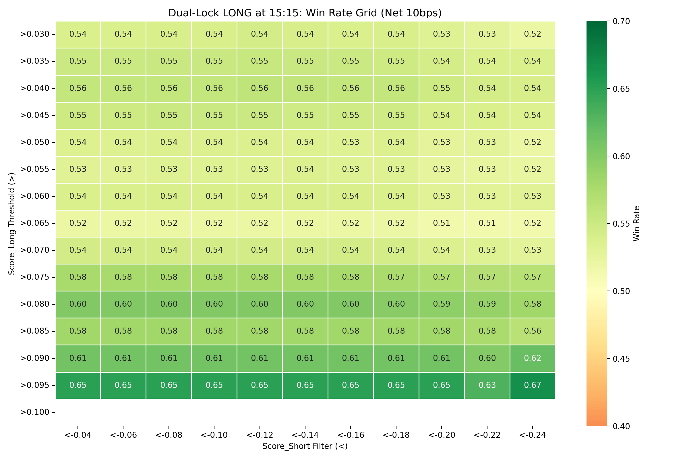
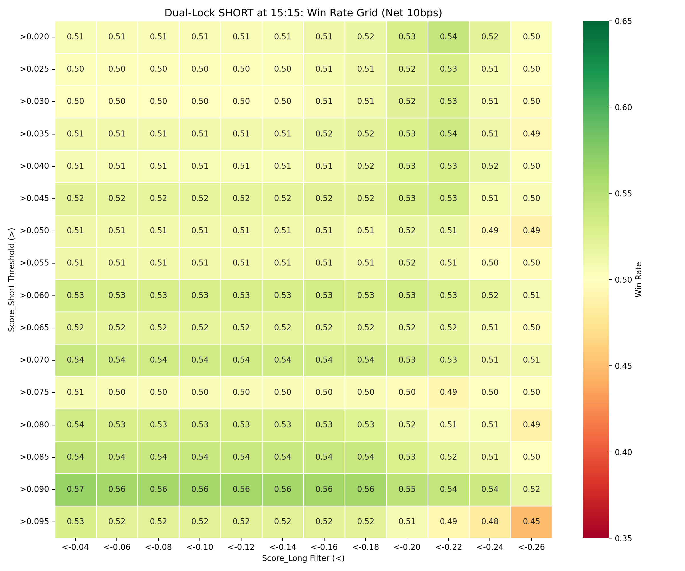

# The Dual-Confirmation Architecture (30-Minute Model)

**Date:** June 4, 2026
**Subject:** Dual-Lock analysis and execution mechanics for the 30-minute Vanguard models.

## The Paradigm Difference vs. 1-Hour Model
The 1-hour model's Dual-Lock was a paradigm-defining discovery — combining both models pushed Short WR from 68% to 76%. For the 30-minute model, the story is fundamentally different: **the Short Model is too weak to act as a meaningful confirmation filter.**

## Visualizing the Parameter Sweet Spots

### The LONG Strategy Sweet Spot (at 15:15 IST)

*(The edge is dominated entirely by the Long score threshold. The Short filter adds negligible discriminative power.)*

### The SHORT Strategy Sweet Spot (at 15:15 IST)

*(The Short side maxes out at ~56% WR. No Dual-Lock configuration achieves the 68-76% WR seen in the 1-hour model.)*

## Dual-Confirmed Long Strategy (at 15:15)
* **Best Config:** `Score_Long > 0.095` AND `Score_Short < -0.04` → 65% WR, +43.7 bps (20 trades/month)
* **Practical Config:** `Score_Long > 0.090` → 61.1% WR, +32.6 bps (36 trades/month)
* **Key Finding:** The Short filter adds <2% WR on top of the standalone Long threshold. This is because the Short Model's probability distribution at 15:15 doesn't meaningfully differentiate between stocks that will rise vs. those that won't.

## Dual-Confirmed Short Strategy (at 15:15)
* **Best Config:** `Score_Short > 0.090` AND `Score_Long < -0.04` → 56.6% WR, +10.7 bps (76 trades/month)
* **Verdict:** Barely above the fee hurdle. Not recommended for deployment.

## Architectural Mandate
Unlike the 1-hour model where the Dual-Lock was essential, the 30-minute model should be deployed in a **Single-Model architecture**:
- **Long Engine:** `xgb_long_model` at 15:15 IST, `Score_Long > 0.075–0.080`.
- **Short Engine (Optional):** `xgb_short_model` at 14:15 IST only, `Score_Short > 0.070+`, with reduced position sizing.

## Time-of-Day Exclusivity
Analysis of the Long Model's high-conviction signals:
* At `Score_Long > 0.070`: **55.3%** of trades execute at 15:15 IST.
* At `Score_Long > 0.080`: **67.1%** of trades execute at 15:15 IST.
* At `Score_Long > 0.090`: **80.0%** of trades execute at 15:15 IST.

The model organically concentrates its highest conviction signals at the final trading slot, consistent with the hypothesis that the 30-minute model's primary alpha is predicting the squaring-off momentum in the last 30 minutes of the session.
