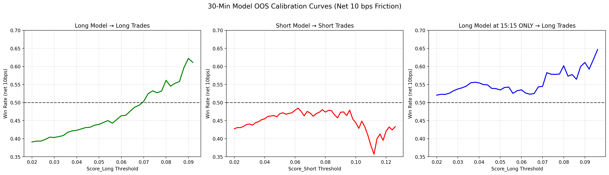

# Comprehensive Empirical Analysis of Model Thresholds & Execution Architecture

**Date:** June 4, 2026
**Subject:** 30-Minute Vanguard Model (v1_30min) Out-of-Sample Calibration, Signal Inversion, and Threshold Mechanics.

## 1. Executive Summary & Architectural Mandate
Extensive stress-testing of the 30-minute model outputs on purely unseen Out-of-Sample (OOS) data has yielded the following structural conclusions:

1. **The Long Model is the primary alpha source.** It achieves a 62.2% Win Rate and +31.7 bps/trade at `Score_Long > 0.090`, but with low volume (45 trades/month). Its edge is concentrated almost entirely at **15:15 IST (End of Day)**.
2. **The Short Model is structurally broken as a standalone signal generator.** It never crosses 50% Win Rate at any threshold level across the full OOS dataset.
3. **The Short Model has a narrow, time-gated edge.** When restricted to **14:15 IST only**, the Short Model achieves a modest 56.3% WR at `Score_Short > 0.050` and up to 60% WR at `> 0.085` (with very low volume).
4. **Signal inversions are dead ends.** Unlike the 1-hour model where inverting the Long model produced a massive Short edge, inversions fail completely for the 30-minute models.

---

## 2. Methodology & Integrity Verification
The evaluation framework applied extreme, pessimistic constraints:
1. **Strict 10 Basis Points (bps) Friction:** A flat 0.0010 (10 bps) deduction on every trade.
2. **True Out-of-Sample Isolation:**
   - **Training Set:** 2025-05 to 2026-04 (501,073 rows)
   - **Testing Set (OOS):** 2026-05 (40,070 rows)
   - **Verification:** Zero overlapping timestamps. All predictions purely on unseen data.

---

## 3. The Signal Inversion Discovery

### A. Inverting the Short Model (FAILURE)
Testing whether a highly negative Short model score (meaning the model strongly believes the stock will *not* drop) serves as a valid Long signal.

| Threshold | Trades | Win Rate | Avg PnL |
|---|---|---|---|
| `< -0.10` | 5,594 | 39.4% | -8.2 bps |
| `< -0.16` | 3,197 | 41.3% | -7.9 bps |
| `< -0.20` | 2,058 | 43.2% | -5.3 bps |
| `< -0.24` | 908 | 46.9% | -2.1 bps |
| `< -0.26` | 471 | 51.0% | +2.1 bps |

**Conclusion:** Marginal at best. The extreme threshold (`< -0.26`) barely crosses 50% with +2.1 bps, which is statistically indistinguishable from random after fees.

### B. Inverting the Long Model (FAILURE)
Testing whether a highly negative Long model score serves as a valid Short signal.

| Threshold | Trades | Win Rate | Avg PnL |
|---|---|---|---|
| `< -0.10` | 7,582 | 41.4% | -5.7 bps |
| `< -0.16` | 3,085 | 43.5% | -2.1 bps |
| `< -0.20` | 1,449 | 43.1% | -0.8 bps |
| `< -0.24` | 421 | 47.3% | +6.5 bps |

**Conclusion:** Failed. Even at extreme thresholds, the WR never crosses 50%. This is a fundamental structural difference from the 1-hour model where the inverted Long was the single most powerful short signal.

---

## 4. Master Thresholds Calibration

### The Long Vector (`Score_Long > 0.070`)
- **Profile:** Low frequency, escalating precision.
- **50% WR Crossover:** ~0.070 (302 trades/month)
- **Sweet Spot:** `> 0.080` → 56.2% WR, +21.1 bps (146 trades)
- **Sniper Tier:** `> 0.090` → 62.2% WR, +31.7 bps (45 trades)

### The Short Vector (Global — BROKEN)
- The Short Model never achieves a sustained win rate above 50% at any threshold.
- Best global result: `> 0.125` → 43.8% WR, +4.9 bps (32 trades). Statistically insignificant.

### The Short Vector (14:15 IST ONLY — Narrow Edge)
When restricted to a single time slot:

| Threshold | Trades | Win Rate | Avg PnL |
|---|---|---|---|
| `> 0.050` | 190 | 56.3% | +3.6 bps |
| `> 0.070` | 55 | 54.5% | +15.8 bps |
| `> 0.085` | 22 | 59.1% | +34.2 bps |
| `> 0.095` | 15 | 60.0% | +45.3 bps |

---

## 5. Backlinks

- [[Complete Edge Catalog]] — Dead Ends and Dual-Lock configurations.
- [[Time of Day Conviction]] — The temporal clustering analysis.
- [[Dual Confirmation Architecture]] — Dual-Lock discovery.
- [[Weekly Consistency & Regimes]] — OOS stability analysis.
