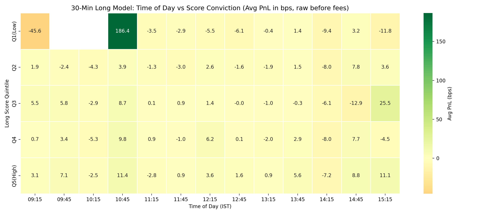
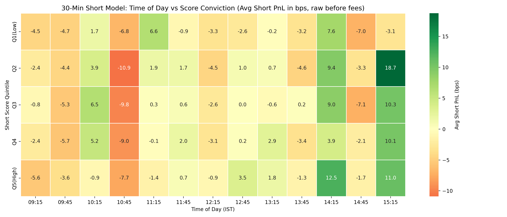

# Time of Day vs. Conviction Score (30-Minute Model)

This document explores how the 30-minute models' conviction scores interact with the time of day, revealing the structural alpha windows.

## The Long Model Heatmap
We divided the OOS data into Score Quintiles (Q1=lowest, Q5=highest) and mapped the Average PnL (in bps, raw before fees) against the 30-minute intraday slot.

## The Short Model Heatmap
Same analysis for the Short Model, with PnL inverted (positive = profitable short).

## The Discovery: The 15:15 EOD Dominance

### Long Model Organic Time Filtering
When the strict `> 0.070` threshold is applied, here is where the model fires and at what quality:

| Time Slot | Trades | Win Rate (10bps) | Avg PnL |
|---|---|---|---|
| **15:15** | **167** | **54.5%** | **+16.8 bps** |
| 14:45 | 60 | 46.7% | -7.2 bps |
| 13:45 | 20 | 45.0% | +3.0 bps |
| All others | <15 each | Unstable | Noise |

At the Sniper threshold (`> 0.080`), the concentration intensifies:

| Time Slot | Trades | Win Rate (10bps) | Avg PnL |
|---|---|---|---|
| **15:15** | **98** | **60.2%** | **+32.1 bps** |
| 14:45 | 28 | 46.4% | -10.8 bps |
| All others | <13 each | Unstable | Noise |

**Conclusion:** The Long Model's edge is overwhelmingly concentrated at **15:15 IST**. Unlike the 1-hour model which peaked at 2:00 PM (capturing the forced-liquidation wave 1 hour later at 3:00-3:30 PM), the 30-minute model fires at the very last slot, directly trading into the closing bell. The model captures the final 30 minutes of squaring-off momentum.

### Short Model Time Filtering
The Short Model has a different temporal profile. Its only statistically viable time slot is **14:15 IST** (56.3% WR at `> 0.050`), where it captures the pre-close mean-reversion before the final EOD surge.

At all other time slots, the Short Model performs at or below random chance.

---

## Implications for Live Engine
1. **Long Model:** Must be restricted to 15:15 IST execution only. All morning and early afternoon signals should be suppressed.
2. **Short Model:** If deployed, must be restricted to 14:15 IST only and with strict thresholds (`> 0.070+`).
