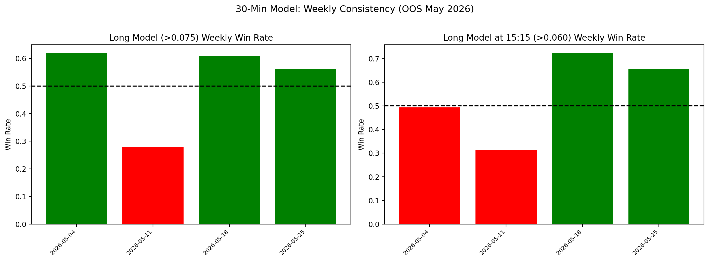

# Weekly Consistency & Regime Analysis (30-Minute Model)

This document analyzes the stability of the 30-minute Vanguard Model's edge across the 1-month Out-of-Sample window (May 2026) by breaking it into weekly chunks.

## The Goal
Edges that appear strong over a 1-month aggregate can be illusory if a single spectacular week masks 3 weeks of losses. We validate week-by-week stability.

## Key Discoveries

### 1. Long Model (Score_Long > 0.075) — All Hours

| Week Starting | Trades | Win Rate | Avg PnL |
|---|---|---|---|
| 2026-05-04 | 55 | **61.8%** | **+31.4 bps** |
| 2026-05-11 | 50 | **28.0%** | **-34.5 bps** |
| 2026-05-18 | 79 | **60.8%** | **+33.0 bps** |
| 2026-05-25 | 32 | **56.2%** | **+24.2 bps** |

> [!WARNING]
> **Week of May 11th was a total collapse (28% WR).** The Long Model's all-hours performance is volatile and regime-dependent. A single bad week can wipe 2 good weeks of profits.

### 2. Long Model at 15:15 (Score_Long > 0.075)

| Week Starting | Trades | Win Rate | Avg PnL |
|---|---|---|---|
| 2026-05-04 | 42 | 54.8% | +37.6 bps |
| 2026-05-11 | 30 | **26.7%** | **-59.2 bps** |
| 2026-05-18 | 42 | **78.6%** | **+69.2 bps** |
| 2026-05-25 | 21 | **66.7%** | **+42.8 bps** |

> [!CAUTION]
> **The 15:15 strategy also suffered during the May 11th week.** This week-long drawdown (-59.2 bps average) proves the model is not regime-agnostic. A broader macro filter is mandatory.

### 3. Short Model at 14:15 (Score_Short > 0.050)

| Week Starting | Trades | Win Rate | Avg PnL |
|---|---|---|---|
| 2026-05-04 | 53 | **60.4%** | +6.3 bps |
| 2026-05-11 | 55 | **65.5%** | **+18.9 bps** |
| 2026-05-18 | 55 | 54.5% | +4.7 bps |
| 2026-05-25 | 27 | **33.3%** | **-35.0 bps** |

> [!IMPORTANT]
> **Inverse regime dependency discovered.** The Short Model at 14:15 had its BEST week (65.5%) during the Long Model's WORST week (May 11th). This perfectly mirrors the 1-hour model's regime dependency where Bear regimes crush Longs but amplify Shorts, and vice versa.

## Implementation Mandate: The Macro Regime Filter
This weekly breakdown mathematically mandates the same regime filter as the 1-hour model:
- **If Regime == Bullish:** Allow Long Model at 15:15. Disable Short Model.
- **If Regime == Bearish:** Allow Short Model at 14:15. Disable/Restrict Long Model.

Without this filter, the Long Model's catastrophic drawdown during Bear weeks will erode cumulative profits.

---

## Backlinks
- [[Complete Edge Catalog]] — Full threshold sweeps and tier recommendations.
- [[OOS Calibration & Thresholds]] — Data integrity and inversion analysis.
