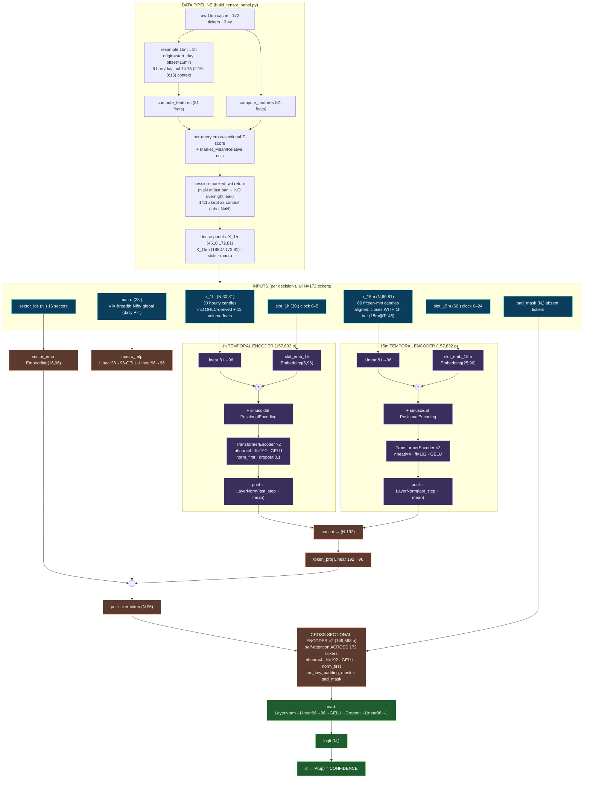

# 🗺️ DualRes Cross-Sectional Transformer — In-Depth Architecture Flowchart

> Companion to [[02. Model Suite/DualRes-CrossSectional-Transformer-Architecture|Architecture summary]] ·
> Code: [model.py](file:///c:/Users/loq/Desktop/Trading/finalgo/scripts/transformer/model.py) ·
> [train.py](file:///c:/Users/loq/Desktop/Trading/finalgo/scripts/transformer/train.py) ·
> [build_tensor_panel.py](file:///c:/Users/loq/Desktop/Trading/finalgo/scripts/transformer/build_tensor_panel.py)
> **509,569 params** @ `d_model=96`. One forward = one 1h timestamp → P(up) for all 172 tickers.

## 1 · End-to-end data + model flow

## 2 · Inputs in full

| Stream | Tensor | What it is |
|---|---|---|
| 1h sequence | `(N,30,81)` | last 30 hourly candles/ticker (incl. **14:15 2:15–3:15 context candle**) |
| 15m sequence | `(N,60,81)` | last 60 fifteen-min candles, aligned to close **with** the 1h bar |
| 1h clock slots | `(30,)` | time-of-day id 0–5 (09:15…14:15) |
| 15m clock slots | `(60,)` | time-of-day id 0–24 (09:15…15:15) |
| macro | `(28,)` | VIX(3) · breadth(5) · Nifty50/500(7) · SP500/NASDAQ/NIKKEI/HSI(8) · USDINR/BRENT/GOLD/DXY/US10Y(5), daily PIT |
| sector_ids | `(N,)` | 16 sectors → learned embedding |
| pad_mask | `(N,)` | True where a ticker is absent at t (ignored by cross-attention) |

**The 81 per-candle features** = `VIEW_A`(21, mean-rev/oscillators) + `VIEW_B`(30, trend/momentum) + `VIEW_C`(30, vol/structure), per-query z-scored.
**Volume (11):** `Volume_Zscore` (+lag1/2/3), `RVOL`, `Dollar_Volume`, `PVO`, `Volume_Change`, `OBV_Dist`, `CMF_20`, `Buy_Pressure`.
*Excluded by design:* raw OHLCV levels (non-stationary) and time-crutch feats `Hour/DayOfWeek/Is_Open_Hour/Is_Close_Hour/Time_To_Close` (overfit clock in v18/v19 — clock info re-added safely as the slot embedding).

## 3 · Positional / time encoding (two signals)
1. **Sinusoidal PositionalEncoding** — fixed sin/cos over sequence index (0…29 for 1h, 0…59 for 15m); gives recency/order.
2. **Learned clock-time slot embedding** — `Embedding(6,96)` for 1h, `Embedding(25,96)` for 15m; added to each candle so the model identifies the open hour vs close hour and sees day boundaries.

Both are **added to the projected features before** the transformer layers.

## 4 · Layer-by-layer (params @ d_model=96)
| Block | Detail | Params |
|---|---|---|
| 1h Linear proj | `81→96` | (in enc_1h) |
| 1h slot emb | `Embedding(6,96)` | 576 |
| 1h Transformer | 2× encoder layer, 4 heads, ff 192, GELU, norm_first, drop 0.1 | **157,632** (enc_1h total) |
| 15m slot emb | `Embedding(25,96)` | 2,400 |
| 15m Transformer | identical, 60-len | **157,632** (enc_15m total) |
| token_proj | `Linear 192→96` | 18,528 |
| sector_emb | `Embedding(16,96)` | 1,536 |
| macro_mlp | `28→96 · GELU · 96→96` | 12,096 |
| cross encoder | 2× encoder layer over N tickers, 4 heads, ff 192 | **149,568** |
| head | `LN→96→96·GELU·Drop→96→1` | 9,601 |
| **TOTAL** | | **509,569** |

Temporal pooling = `LayerNorm(last_step + mean_pool)`. Cross-attention masks absent tickers via `src_key_padding_mask`.

## 5 · Training configuration
| Item | Value |
|---|---|
| Loss (default) | `BCEWithLogitsLoss` on `sign(Next_Hour_Return)` → **direction + confidence** |
| Loss (cost-aware variant) | net-PnL: `−mean(pos·r − cost·|pos|)`, `pos=2σ(logit)−1`, no-trade at pos→0 |
| Optimizer | **AdamW**, lr `3e-4`, weight_decay `1e-2` |
| LR schedule | **CosineAnnealingLR** (`T_max=epochs`) |
| Precision | **AMP** mixed precision (`torch.amp.GradScaler`, fp16) |
| Grad clip | global-norm `1.0` |
| Batch | 6 timestamps × 172 tickers |
| Regularization | dropout 0.1 · weight decay · early stop (patience 6) on val AUC (or val net-PnL@10) |
| Splits | chronological **70/15/15** with **embargo 30** decision bars |
| Device | RTX 5050 8 GB, CUDA, ~25–45 s/epoch |
| Masking | loss only over `present & finite-label` tickers |

## 6 · Output
`logit (N,)` → `σ` → **P(up) per ticker = confidence**. Long if >0.5, short if <0.5. No ranking, no magnitude regression. Cost-aware eval (Top-K & selective net bps @ 6/10) is a **tradeability diagnostic only** — the Validation Gauntlet holds verdict authority.

## 7 · No-leak guarantees
- Alignment asserted: 1h@T (left) ⟺ 15m@(T+45m); 15m window close-time == 1h close-time.
- Forward returns session-masked (no overnight); 14:15 candle is input context only (label NaN).
- Per-query z-scoring is contemporaneous (cross-section at t) → no lookahead.
- Feature standardization / NaN→0 imputation is split-agnostic (z-scores are per-bar cross-sectional).
