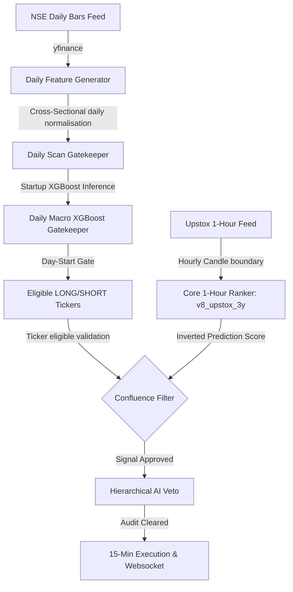

# ⏱️ Multi-Timeframe Architecture (Actual V2.3 Specifications)

To maintain absolute entry precision and avoid trading against the macroeconomic tide, the **Vanguard V2.3** engine utilizes a multi-timeframe filtering pipeline. However, rather than executing a complex four-model real-time confluence lookup on every candle (which induces latency and standard-error accumulation), the system splits multi-timeframe alignment into **offline macro gatekeeping** and **active hourly ranking**.

---

## 🏗️ Aligned Timeframe Architecture

Every stock's signal is validated by a time-separated, asymmetric filter matrix. Intraday entries must align with daily macroeconomic vectors and be executed on precise candlestick closes.

---

## 📊 The Active Multi-Timeframe Pipeline

The trading system achieves multi-timeframe consensus by using three distinct operational phases:

### 1. Daily Macro Trend Scan (The Gatekeeper)
*   **Execution**: Runs once daily at startup or day-start (`update_daily_macro_filters()`).
*   **Data Inputs**: Single download of 1 year of daily historical candles from `yfinance` for all configured `TICKERS`.
*   **The Models**: Fits **165 Daily Features** (capturing long-term momentum, volatility compression, and range breakouts) and runs cross-sectional normalization. It passes them to the daily gatekeeper:
    *   **Daily Macro XGBoost** (`models/daily_xgb/xgb_long_model.json` / `xgb_short_model.json`): Evaluates directional trend strength.
*   **Output**: Registers `long_eligible_tickers` and `short_eligible_tickers` (top 40%). If a stock is not in the eligible list, it is blocked from new trades in that direction for the entire day.

### 2. Unified 1-Hour Core Ranking Specialist
*   **Execution**: Sweeps exactly on 15-minute candle boundaries.
*   **Data Inputs**: Fetches 60 days of hourly candlestick data from Upstox (using historical cached files).
*   **Indicator Math**: Computes **81 core technical indicators + 6 hourly additions + 4 daily context features** via `scripts/feature_utils.py`.
*   **Daily Context Integration**: To keep the hourly ranker aware of daily dynamics, daily indicators (like `Daily_RSI`, `Daily_SMA20_Dist`, `Daily_Trend`, `Daily_ATR_Pct`) are programmatically injected directly into the hourly feature set.
*   **Model**: Infers through active registered hourly ranker—currently **v8_upstox_3y** (trained on 3 years of hourly candles and packed with microstructure liquidity features).

### 3. 15-Minute Real-Time Execution & WS Cache
*   **Execution**: Polles and processes prices every 5 seconds.
*   **Data Inputs**: A background thread manages `upstox_websocket.py` to stream real-time tick updates directly into an in-memory cached DataFrame (no REST latency!).
*   **Purpose**: 
    *   **Candle Confirmation**: Pending signals are executed only on the close of the next 15-minute candle in the trade's direction.
    *   **Exit Monitoring**: Polls every 5 seconds to detect Stop Loss, Take Profit, Breakeven, and Trailing stops immediately.
    *   **XGBoost Re-verification**: Checks if conviction scores drop (`conv_score < 0.10`) or flip against direction at entry and every 15 minutes.
    *   **No Active 15M Model Inference**: No standalone 15-minute ML ranking model is run during active trading scans. Real-time data is only resampled to calculate the dynamic **15-Minute ATR volatility risk brackets** (1.5x and 3.0x multipliers).

---

## ⏱️ Time-Alignment Lookups (Scan Boundary)

Live scanner runs lookups systematically at every scan boundary:
1.  **15-Minute Candle Closes**: The scheduler wakes up exactly at `:00`, `:15`, `:30`, `:45`.
2.  **Candle Direction Check**: Looks up the last completed 15-minute candle on Upstox.
3.  **Active Signal Sweep**: Runs the 1-hour core model to score the entire universe (reads from latest hourly candles).
4.  **Daily Gatekeeper Aligned**: Verifies the resulting signal tickers against the daily eligibility lists before calling the AI Veto layer.

---

## 👁️ Key Related Notes
*   See how daily macro trend models are trained: [[04. Data & Code Map/Codebase File Directory|Codebase File Directory]].
*   See where the models are loaded: [[02. Model Suite/Model Registry & File Structures|Model Registry & File Structures]].
*   Review our dynamic 15M ATR calculations: [[04. Data & Code Map/Shadow Tracker & Execution Loop|Shadow Tracker & Execution Loop]].
