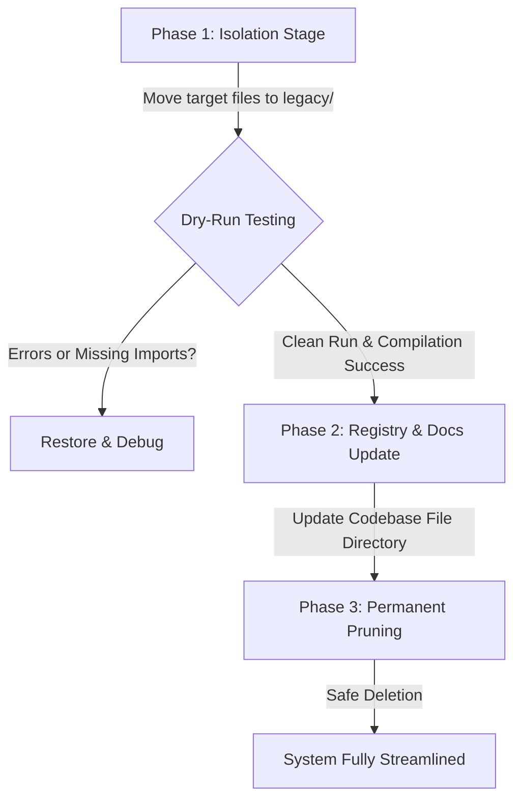

# 🧹 Codebase & Documentation Cleanup Strategy
## Vanguard V2.3 Alignment

As the Vanguard system has evolved from its V1 baseline to the multi-model **Vanguard V2.3 Ensemble**, a significant amount of redundant files, developer scratchpads, obsolete backtesters, and outdated documentation files have been left in the workspace.

This document establishes a **comprehensive inventory of stale assets** and defines a **safe, non-destructive phased implementation strategy** to clean up the codebase. This ensures the workspace is extremely clean, lightweight, and aligned with your system documentation.

---

## 🎯 Core Goals
1.  **De-Clutter the Workspace**: Separate active production code and core backtesters from legacy models and quick debugging scripts.
2.  **Ensure Zero Disruptions**: Execute the cleanup using a phased, non-destructive isolation method so that no live executions (`vanguard_signal_engine.py`) or active dashboard elements are broken.
3.  **Align Documentation**: Retire old documentation files that describe inactive workarounds (like raw prediction inversion) or outdated roadmaps, keeping the shared memory layer perfectly accurate.

---

## 🔍 Codebase Audit: Stale & Legacy Files

The following files have been audited and identified as stale, redundant, or obsolete for the current scope of Vanguard V2.3:

### 🐍 1. Developer Scratchpads & Quick Tests (Safe to Delete)
These are temporary one-off test scripts in the root and scripts folders that do not belong in production.

| File Path | Original Purpose | Rationale for Removal |
| :--- | :--- | :--- |
| [`verify_strategy_22.py`](file:///c:/Users/loq/Desktop/Trading/finalgo/verify_strategy_22.py) | Temporary verification for S22 | One-off check; logic is already merged into core backtester. |
| [`test_upstox_2021.py`](file:///c:/Users/loq/Desktop/Trading/finalgo/test_upstox_2021.py) | Historical Upstox API test | Obsolete connection draft. |
| [`scratch_check.py`](file:///c:/Users/loq/Desktop/Trading/finalgo/scratch_check.py) | Debugging script for live data | Replaced by active sandbox debugger scripts. |
| [`scratch_check_times.py`](file:///c:/Users/loq/Desktop/Trading/finalgo/scratch_check_times.py) | Timestamp checking debug | Obsolete. |
| [`scripts/test_1h.py`](file:///c:/Users/loq/Desktop/Trading/finalgo/scripts/test_1h.py) | Simple 1H data fetch test | Standardized unit tests and `upstox_debug.py` cover this. |
| [`scripts/test_quick.py`](file:///c:/Users/loq/Desktop/Trading/finalgo/scripts/test_quick.py) | Rapid sandbox checks | Obsolete. |
| [`scripts/raw_test.py`](file:///c:/Users/loq/Desktop/Trading/finalgo/scripts/raw_test.py) | Original raw API loader test | Redundant diagnostic file. |
| [`scripts/raw_test2.py`](file:///c:/Users/loq/Desktop/Trading/finalgo/scripts/raw_test2.py) | API parameter test | Redundant diagnostic file. |
| [`scripts/raw_test3.py`](file:///c:/Users/loq/Desktop/Trading/finalgo/scripts/raw_test3.py) | API return test | Redundant diagnostic file. |

---

### 🧠 2. Retired Training Pipelines & Drafts (Archive)
These are scripts used to train models that are no longer active, including retired PyTorch daily transformer pipelines.

| File Path | Original Purpose | Rationale for Archiving |
| :--- | :--- | :--- |
| [`scripts/train_daily_transformer.py`](file:///c:/Users/loq/Desktop/Trading/finalgo/scripts/train_daily_transformer.py) | Initial daily PyTorch Transformer trainer | Retired. Sequence transformer is inactive for active trading. |
| [`scripts/train_daily_transformer_v2.py`](file:///c:/Users/loq/Desktop/Trading/finalgo/scripts/train_daily_transformer_v2.py) | Refined Transformer trainer | Inactive (Fully replaced by pure XGBoost daily gatekeeper). |
| [`scripts/rebuild_transformer_dataset.py`](file:///c:/Users/loq/Desktop/Trading/finalgo/scripts/rebuild_transformer_dataset.py) | Transformer-specific feature dataset rebuild | Transformer model is retired; no longer need to rebuild its datasets. |
| [`scripts/rebuild_xgb_dataset.py`](file:///c:/Users/loq/Desktop/Trading/finalgo/scripts/rebuild_xgb_dataset.py) | Raw XGBoost dataset rebuild | Training scripts `train_ranking.py` handle dataset updates natively. |
| [`scripts/train_daily_xgboost.py`](file:///c:/Users/loq/Desktop/Trading/finalgo/scripts/train_daily_xgboost.py) | Initial Daily XGBoost model trainer | Replaced by the v2 training pipeline. |

---

### 📂 3. Legacy Data Prep & Intermediate Collectors (Archive)
These files represent old data pipelines before we standardized the 1-Hour (`collect_upstox_3y.py`) and Daily (`collect_upstox_daily_5y.py`) data collections.

| File Path | Original Purpose | Rationale for Archiving |
| :--- | :--- | :--- |
| [`scripts/collect_upstox_15min_1y.py`](file:///c:/Users/loq/Desktop/Trading/finalgo/scripts/collect_upstox_15min_1y.py) | 15-minute candle cache download | Redundant; 15-minute candles are managed dynamically or via REST. |
| [`scripts/collect_upstox_5min_may.py`](file:///c:/Users/loq/Desktop/Trading/finalgo/scripts/collect_upstox_5min_may.py) | 5-minute candle downloader for May | Outdated temporary collection. |
| [`scripts/prepare_ranking_data_15min.py`](file:///c:/Users/loq/Desktop/Trading/finalgo/scripts/prepare_ranking_data_15min.py) | 15m feature data alignment | Pre-calculated offline; no longer actively run. |
| [`scripts/prepare_ranking_data_30min.py`](file:///c:/Users/loq/Desktop/Trading/finalgo/scripts/prepare_ranking_data_30min.py) | 30m feature data alignment | Pre-calculated offline; no longer actively run. |
| [`scripts/prepare_ranking_data_upstox.py`](file:///c:/Users/loq/Desktop/Trading/finalgo/scripts/prepare_ranking_data_upstox.py) | Hourly feature data alignment | Merged into main dataset builders. |
| [`scripts/prepare_ranking_data_yfinance.py`](file:///c:/Users/loq/Desktop/Trading/finalgo/scripts/prepare_ranking_data_yfinance.py) | YFinance data alignment | We have migrated fully to Upstox cache files. |

---

### 🧪 4. Redundant Diagnostic Sweeps & Temporary Runs (Archive)
These are backtesting sweeps or temporary scripts built during specific iterations (like optimizing S19 or sweeps of close entries).

| File Path | Original Purpose | Rationale for Archiving |
| :--- | :--- | :--- |
| [`scripts/patch_and_run_s19.py`](file:///c:/Users/loq/Desktop/Trading/finalgo/scripts/patch_and_run_s19.py) | Temporary patch for Strategy 19 | Closed iteration. |
| [`scripts/run_s19_temp.py`](file:///c:/Users/loq/Desktop/Trading/finalgo/scripts/run_s19_temp.py) | Standalone test run for Strategy 19 | Combined into main strategy backtester. |
| [`scripts/hourly_close_entry_sweep.py`](file:///c:/Users/loq/Desktop/Trading/finalgo/scripts/hourly_close_entry_sweep.py) | Entry logic parameter sweep | Research complete; results integrated. |
| [`scripts/hourly_ensemble_sweep.py`](file:///c:/Users/loq/Desktop/Trading/finalgo/scripts/hourly_ensemble_sweep.py) | Ensemble parameter sweep | Research complete. |
| [`scripts/intraday_strict_sweep.py`](file:///c:/Users/loq/Desktop/Trading/finalgo/scripts/intraday_strict_sweep.py) | Strict stop-loss backtest sweep | Research complete. |
| [`scripts/long_hold_sweep.py`](file:///c:/Users/loq/Desktop/Trading/finalgo/scripts/long_hold_sweep.py) | Long holding time sweep | Research complete. |
| [`scripts/signal_sweep_1h_hold.py`](file:///c:/Users/loq/Desktop/Trading/finalgo/scripts/signal_sweep_1h_hold.py) | Hourly sweep checking parameters | Research complete. |
| [`scripts/signal_sweep_analysis.py`](file:///c:/Users/loq/Desktop/Trading/finalgo/scripts/signal_sweep_analysis.py) | Compilation of sweep results | Research complete. |

---

### 📝 5. Obsolete Documentation & Markdown Files (Archive/Delete)
These are markdown files in `docs/` and `finalgo-memory-layer/` that contain retired concepts, outdated performance statistics, or roadmap drafts that do not reflect Vanguard V2.3.

| File Path | Original Purpose | Rationale for Retiring |
| :--- | :--- | :--- |
| [`docs/WHY_INVERTED_XGBOOST.md`](file:///c:/Users/loq/Desktop/Trading/finalgo/docs/WHY_INVERTED_XGBOOST.md) | V1 baseline documentation of inverted models | **Obsolete**. Vanguard V2.3 uses separate, non-inverted Long and Short models. |
| [`docs/improvement_strategy.md`](file:///c:/Users/loq/Desktop/Trading/finalgo/docs/improvement_strategy.md) | Outdated improvement plan | Pre-V2.3 research notes. |
| [`docs/EVALUATION_REPORT.md`](file:///c:/Users/loq/Desktop/Trading/finalgo/docs/EVALUATION_REPORT.md) | Pre-inversion diagnostic metrics | Pre-V2.3 research notes. |
| [`finalgo-memory-layer/finalgo/05. Archives/Outdated Vanguard V1 Baseline.md`](file:///c:/Users/loq/Desktop/Trading/finalgo/finalgo-memory-layer/finalgo/05. Archives/Outdated Vanguard V1 Baseline.md) | Ledger of V1 baseline parameters | Safe to remove as it is already cataloged inside `/05. Archives`. |
| [`finalgo-memory-layer/finalgo/05. Archives/Dual-Specialist & Meta-Routing (Roadmap).md`](file:///c:/Users/loq/Desktop/Trading/finalgo/finalgo-memory-layer/finalgo/05. Archives/Dual-Specialist & Meta-Routing (Roadmap).md) | Outdated developmental roadmap | Replaced by the active system architecture. |

> [!NOTE]
> **Docs Reorganization Update (June 1, 2026)**: The `docs` folder has been completely streamlined. All 7 active, high-value technical specifications (e.g. `SYSTEM_FEATURES.md`, `MODEL_INFERENCE_DATA.md`, `FEATURE_ENGINEERING.md`) have been promoted to their correct directories in the `finalgo-memory-layer/` vault to enrich active core memory. All 15 historical/obsolete markdown files have been safely relocated to `legacy_archive/docs/` (along with `docs/daily_reports/`), and the empty `docs` directory has been removed. All links and backlinks in `Welcome.md` have been fully realigned.

---

## 🛠️ Implementation Strategy: Phased Cleanup

To avoid breaking the live trading engine or web server due to hidden imports or path dependencies, we will execute the codebase pruning in three distinct phases:

### 📦 Phase 1: Isolation (Safety First)
1.  Create a root-level directory: `legacy_archive/`.
2.  Move all target python files identified in **Section 1 through 4** from the workspace and `/scripts` directories into `legacy_archive/`.
3.  Move all outdated markdown files identified in **Section 5** to `legacy_archive/docs/`.
4.  **Dry-Run Verification**:
    *   Compile the live system engine: `env\Scripts\python -c "import scripts.vanguard_signal_engine"`.
    *   Boot up the dashboard: `env\Scripts\python scripts/vanguard_dashboard.py` and query `/vanguard_status`.
    *   Confirm both processes launch perfectly with zero missing imports or path lookup exceptions.

### 📝 Phase 2: Shared Memory Registry Realignment
1.  Update the **[`Codebase File Directory.md`](file:///c:/Users/loq/Desktop/Trading/finalgo/finalgo-memory-layer/finalgo/04. Data & Code Map/Codebase File Directory.md)** index to explicitly catalog only the active, vetted production scripts.
2.  Update the **[`Current Context.md`](file:///c:/Users/loq/Desktop/Trading/finalgo/finalgo-memory-layer/finalgo/06. Context & Logs/Current Context.md)** active focus to reflect a streamlined, light codebase.

### 🗑️ Phase 3: Permanent Pruning
1.  Once the system has successfully completed 5 consecutive days of sandbox shadow tracking without a single dependency issue, permanently delete the `legacy_archive/` directory.
2.  Commit the clean, optimized codebase branch to Git.

---

*Linked to: [[00 — Start Here/Welcome|Main Navigation Index]] · [[06 — Logs/Active Board|Current Focus & Next Steps]]*
