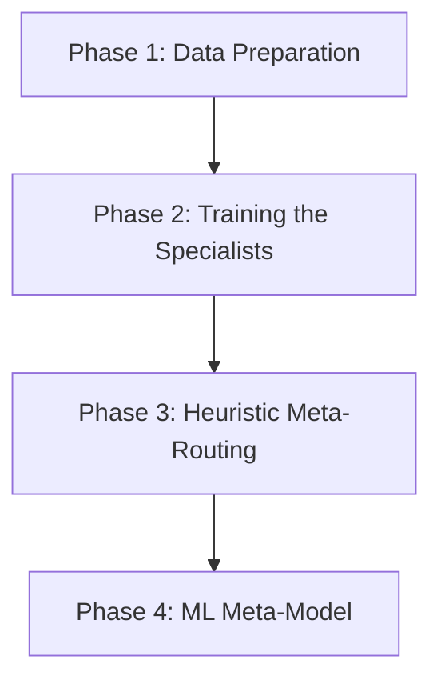

# Journey to Vanguard v2.0: Specialized Multi-Model Ensemble
**Date:** May 27, 2026 | **Version:** v2.0 Design Specification | **Target System:** Vanguard Centaur Engine

---

## 1. The Starting Point: Vanguard v1.0.0 (Our Baseline)

As of May 27, 2026, **Vanguard v1.0.0** (`v8_upstox_3y`) is running successfully. It uses a single, highly regularized XGBoost model trained on 3 years of hourly data. 
* **Current Behavior:** The model acts primarily as an **Intraday Mean-Reversion Specialist**. 
* **Why:** The target metrics (1-hour returns), the feature set (EMA distances, Bollinger %B, CCI), and the hourly time horizon naturally favor capturing short-term market overreactions and subsequent reversions.
* **Limitations:** Because it is a single model, any attempts to learn momentum or breakout continuation are diluted. Breakout features (like 52W Highs or momentum indicators) conflict with reversal features, causing the tree splits to squash predicted convictions.

---

## 2. The Core Philosophy of Vanguard v2.0

Instead of trying to train "one giant model" to solve all market anomalies, **Vanguard v2.0 splits the execution into specialized alpha sub-models arbitrated by a Meta-Decision Layer.**

```text id="f4k9q3"
                    MARKET DATA
                         ↓
                Feature Engineering
                         ↓
        --------------------------------
        |                              |
 Mean-Reversion Model          Breakout Model
        |                              |
 Reversal Probability         Momentum Probability
        -----------      --------------
                    ↓
             Meta Decision Layer
                    ↓
           LONG / SHORT / NO TRADE
```

---

## 3. The Specialized Model Breakdown

### Model A: The Reversal Specialist (`MR_Model_v2`)
This model focuses strictly on detecting extreme price overextensions and predicting the probability of exhaustion and subsequent reversion.

* **Target Labeling:** Rather than raw next-hour return, the model is trained on a binary classification target: **"Did a highly stretched price revert cleanly?"**
  * *Stretch calculation:*
    $$\text{Stretch} = \frac{\text{Close} - \text{EMA}_{20}}{\text{ATR}_{14}}$$
  * *Reversion Target:*
    $$\text{Target} = 1 \text{ if } \left(\text{Stretch} > 2.0 \text{ and } \frac{\text{Future Return}_{1h} - \text{Mean Return}}{\text{Std Return}} < -2.0\right) \text{ else } 0$$
* **Best Features:**
  * **Exhaustion Indexes:** Bollinger %B, Keltner Width, distance to EMAs/VWAP.
  * **Oscillators:** RSI, Stochastic (%K, %D), CCI.
  * **Timing Seasonality:** Open/Close Hour flags, Time To Close.

### Model B: The Breakout Specialist (`BO_Model_v1`)
This model focuses strictly on volatility contraction (coiling) followed by strong momentum expansion and continuation.

* **Target Labeling:** Trained to classify whether a price breach outside a boundary runs in the breakout direction over a longer horizon.
  * *Breakout Target:*
    $$\text{Target} = 1 \text{ if } \left(\text{Close} > \text{Rolling High}_{20} \text{ and } \text{Future Return}_{3h} > 3\%\right) \text{ else } 0$$
* **Best Features:**
  * **Volume Expansion:** RVOL, volume change spikes.
  * **Volatility Compression:** Bollinger Band Width squeeze indicators.
  * **Trend Strength:** EMA Slope, ADX.
  * **Momentum:** ROC, PPO, MACD.

---

## 4. The Meta Decision Layer

The Meta Layer acts as the router. It uses **Regime Features** to determine which model to listen to in any given hour.

```text
                           [Signal Generator]
                       /                        \
           Reversal Prob: 82%              Breakout Prob: 11%
                       \                        /
                     [Regime Condition Routing]
                                  │
                   Is ADX > 25 (Strong Trend)?
                        ├── Yes ──> Route to Breakout Model ──> IGNORE SIGNAL
                        └── No  ──> Route to Reversal Model ──> EXECUTE SHORT
```

### Routing Rules (Heuristic):
* **Range-Bound / Choppy Regime (ADX < 20, Volatility High):** Ignore breakout signals. Route all execution power to the **Reversal Specialist**.
* **Strong Trending / Momentum Expansion (ADX > 25, ATR Expanding):** Ignore reversal signals (to avoid catching falling knives). Route all execution power to the **Breakout Specialist**.

---

## 5. Technical Implementation Roadmap



### Phase 1: Data Preparation (V2 Features & Targets)
* Build a new data prep script (`prepare_v2_data.py`).
* Generate the volatility-adjusted **Reversal Target** and the 3-hour **Breakout Target**.
* Add trend-strength features (ADX, Bollinger Squeeze, EMA slopes).

### Phase 2: Training the Specialists
* Train `MR_Model_v2` and `BO_Model_v1` using XGBoost Binary Classification (`binary:logistic` objective with log-loss metrics).
* Keep hyperparameter depth shallow (max depth 4-5) to prevent overfitting on the noise.

### Phase 3: Heuristic Meta-Routing
* Update the live trading engine (`vanguard_signal_engine.py`) to run dual-inference on every scan cycle.
* Implement the ADX/VIX routing logic inside the tracker to determine the final trade actions.

### Phase 4: Machine Learning Meta-Model
* Once 100+ live trades are logged, train a final decision engine that takes `[reversal_prob, breakout_prob, ADX, VIX]` as inputs and outputs the optimal position size and action.
